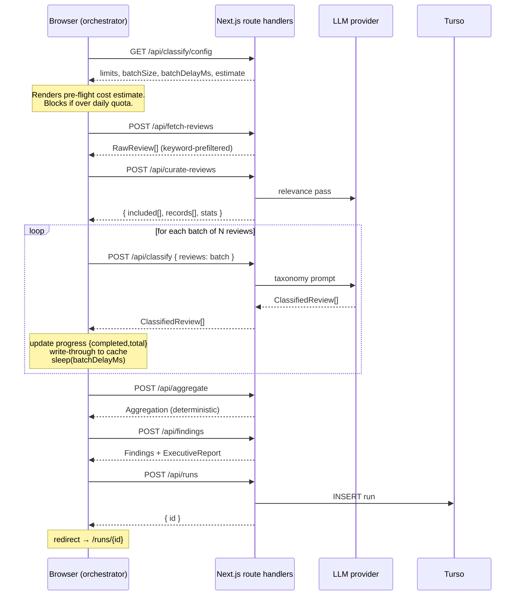
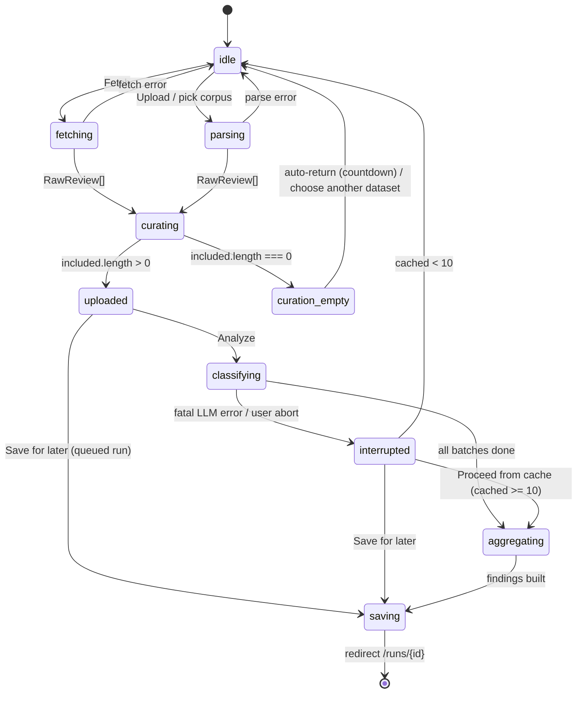
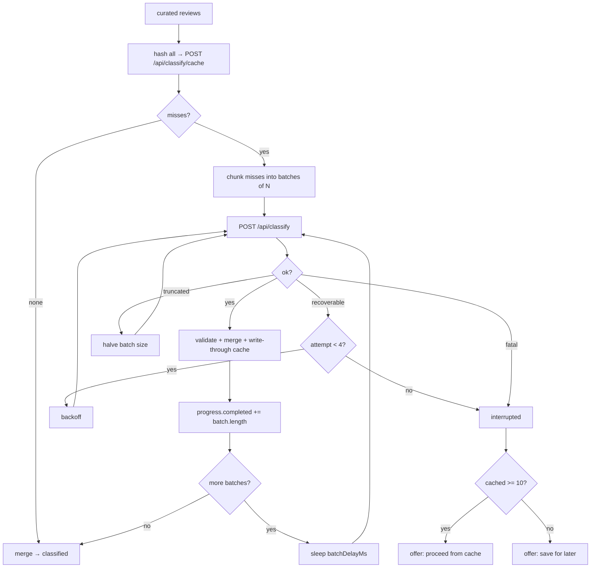

# ReviewLens — Architecture

**Blinkit category-discovery engine.** Companion document to [`README.md`](README.md).

| Document | Answers |
|---|---|
| [`README.md`](README.md) | *What* the engine does, *why* each decision was made, *how to use it* |
| `architecture.md` (this file) | *How it is built* — component boundaries, contracts, control flow, invariants, failure handling, and the phase-by-phase build order |
| [`implementation-plan.md`](implementation-plan.md) | *In what order to build it* — work breakdown, acceptance criteria, dependencies, estimates, risks |
| [`edge-cases.md`](edge-cases.md) | *What breaks it* — phase-by-phase failure catalogue, severity-graded, with required handling |
| [`eval.md`](eval.md) | *How it is measured* — gold set, metrics, thresholds, release gates |

> Some behaviours described here are **hardening we specify, not features that already exist** in the reference build. They are listed in one place — [README §23, Shipped vs. specified](README.md#23-shipped-vs-specified).

This document is written to be sufficient for a second engineer to reimplement the system from scratch without reading the source.

**Domain scope.** The engine analyses public review chatter to answer why Blinkit customers repeat-buy the same categories and what would move them to try a new one. Everything Blinkit-specific is confined to the **L1 domain-configuration layer** ([§3](#3-layer-map--dependency-rules)); every other layer is domain-agnostic. The pipeline was first validated on a music-discovery corpus before being retargeted through those L1 files — see README Appendix A for that run and its measured funnel ratios.

---

## Table of contents

**Part I — System architecture**
1. [Architectural overview](#1-architectural-overview)
2. [Execution model](#2-execution-model-why-the-client-orchestrates)
3. [Layer map & dependency rules](#3-layer-map--dependency-rules)
4. [The pipeline state machine](#4-the-pipeline-state-machine)
5. [Cross-cutting concerns](#5-cross-cutting-concerns)

**Part II — Runtime phases**

6. [Phase 0 — Session bootstrap & capacity negotiation](#phase-0--session-bootstrap--capacity-negotiation)
7. [Phase 1 — Ingest](#phase-1--ingest)
8. [Phase 2 — Preprocess & curate](#phase-2--preprocess--curate)
9. [Phase 3 — Classify](#phase-3--classify)
10. [Phase 4 — Aggregate](#phase-4--aggregate)
11. [Phase 5 — Findings](#phase-5--findings)
12. [Phase 6 — Executive synthesis](#phase-6--executive-synthesis)
13. [Phase 7 — Persist](#phase-7--persist)
14. [Phase 8 — Explore & export](#phase-8--explore--export)

**Part III — Supporting architecture**

15. [Persistence architecture](#15-persistence-architecture)
16. [Error taxonomy & resilience](#16-error-taxonomy--resilience)
17. [Deployment topology](#17-deployment-topology)
18. [Security & privacy architecture](#18-security--privacy-architecture)
19. [Scaling path](#19-scaling-path)
20. [Architecture decision records](#20-architecture-decision-records)

**Part IV — Delivery**

21. [Phase-wise build roadmap](#21-phase-wise-build-roadmap)
22. [Test architecture](#22-test-architecture)
23. [Extension points](#23-extension-points)

---

# Part I — System architecture

## 1. Architectural overview

ReviewLens is a **linear, append-only research pipeline** with a persistent run store attached at the end. Each phase is a pure-ish transformation over the previous phase's output, and each phase's output is a stable, typed contract.

```
                    ┌──────────────────────────────────────────┐
                    │        DOMAIN CONFIGURATION LAYER        │
                    │  research-questions.ts · taxonomy.ts     │
                    │  categories.ts · keyword-filter.ts       │
                    └───────┬───────────────┬──────────────────┘
                            │ feeds prompts │ validates output
                            ▼               ▼
 ┌─────────┐   ┌─────────┐   ┌─────────┐   ┌─────────┐   ┌─────────┐   ┌─────────┐
 │ INGEST  │──▶│ CURATE  │──▶│CLASSIFY │──▶│AGGREGATE│──▶│FINDINGS │──▶│SYNTHESIS│
 │  P1     │   │   P2    │   │   P3    │   │   P4    │   │   P5    │   │   P6    │
 └─────────┘   └─────────┘   └─────────┘   └─────────┘   └─────────┘   └─────────┘
   scrape        LLM #1        LLM #2       pure code     templated      templated
   + regex       (cheap)      (expensive)    NO LLM       + aggregates   + scoring
      │              │             │             │             │             │
      └──────────────┴─────────────┴─────────────┴─────────────┴─────────────┘
                                          │
                                          ▼
                              ┌───────────────────────┐
                              │   PERSIST (P7)        │  Turso / libSQL
                              │   immutable run       │
                              └───────────┬───────────┘
                                          ▼
                              ┌───────────────────────┐
                              │   EXPLORE (P8)        │  dashboard · quotes
                              │                       │  chat · compare · export
                              └───────────────────────┘
```

### The three architectural spines

**Spine 1 — The narrowing funnel.** Volume drops by roughly two orders of magnitude across P1→P2, and cost per unit rises by roughly the same factor. Every architectural decision in P1/P2 exists to make the expensive stages (P3) affordable.

```
~5,000 scraped  →  ~225 unique on-topic  →  ~165 research-grade  →  ~40 in findings
    ~free            ~free (regex)            1 LLM pass             1 LLM pass
```

Those ratios are measured, not guessed — they come from the pilot funnel (README Appendix A) and hold as the planning assumption for Blinkit: **end-to-end survival is ~4.5%, so scrape 20–25× your target analysis volume.**

**Spine 2 — The determinism gradient.** The system deliberately moves from *generative* to *deterministic* and back:

| Phase | Nature | Can it invent a fact? |
|---|---|---|
| P1 Ingest | Deterministic (scrape + regex) | No |
| P2 Curate | Generative (bounded boolean + enum) | No — output space is 2 booleans + a small enum |
| P3 Classify | Generative (bounded to closed enums) | No — every field validated against a fixed array |
| P4 Aggregate | **Fully deterministic** | **No — no LLM present** |
| P5 Findings | Templated over P4 numbers | No — numbers are injected, not generated |
| P6 Synthesis | Scored + templated + gated | No — scores are arithmetic, text is templated |

The only free-text the LLM contributes to the final artifact is `evidence`, `user_goal`, and `classification_reasons` — all of which are *quotations or justifications*, not claims.

**Spine 3 — The audit chain.** Every artifact retains a pointer back to the reviews that produced it.

```
Executive slide → Opportunity → Insight cluster → mechanism key → ClassifiedReview[]
                                                                 → review_id → raw text + source
```

No node in that chain may be constructed without a non-empty child set. This is enforced structurally, not by convention (see [§5.4 Invariants](#54-global-invariants)).

---

## 2. Execution model: why the client orchestrates

**The problem.** Classifying a 400-review corpus at 14.3 s/batch takes ~33 minutes of wall time. No serverless platform allows a 33-minute request. A naive `POST /api/analyze` that runs the whole pipeline dies at the platform timeout, having burned the entire token budget.

**Three candidate designs:**

| Design | Pros | Cons | Verdict |
|---|---|---|---|
| A. Single long server request | Simple client | Exceeds serverless timeout; no progress; all-or-nothing loss | ✗ |
| B. Server-side job queue + worker | Survives disconnect; scalable | Needs a queue, a worker runtime, a poll/SSE channel, job state | Deferred (see [§19](#19-scaling-path)) |
| C. **Client-orchestrated, stateless routes** | Every route < 30 s; live progress; resumable via cache; zero infra | Tab must stay open; browser is the scheduler | **✓ Chosen** |

**Design C in practice:**



**Consequences of choosing C, and how each is mitigated:**

| Consequence | Mitigation |
|---|---|
| Closing the tab kills the run | Write-through classification cache — reopening and re-running skips completed batches |
| No cross-device resume | "Save for later" persists the *curated corpus* as a queued run before classification |
| Client holds the whole corpus in memory | Corpora are capped (guidance: ≤ 500 reviews); large sets are split into queued runs |
| Rate-limit state is per-tab | Two concurrent tabs will breach RPM — documented single-operator assumption |
| Progress is not observable server-side | Accepted; the run row is written only on completion, so partial runs never pollute the repository |

---

## 3. Layer map & dependency rules

```
┌────────────────────────────────────────────────────────────────────┐
│ L5  PRESENTATION      app/**/page.tsx · components/**              │
│                       dashboard, quotes, history, compare          │
└────────────────────────────┬───────────────────────────────────────┘
                             │ may import L4, L1 (types only)
┌────────────────────────────▼───────────────────────────────────────┐
│ L4  ORCHESTRATION     app/page.tsx pipeline driver                 │
│                       state machine · batching loop · progress     │
└────────────────────────────┬───────────────────────────────────────┘
                             │ calls L3 over HTTP only
┌────────────────────────────▼───────────────────────────────────────┐
│ L3  TRANSPORT         app/api/**/route.ts                          │
│                       thin: parse → validate → delegate → respond  │
└────────────────────────────┬───────────────────────────────────────┘
                             │ may import L2, L1
┌────────────────────────────▼───────────────────────────────────────┐
│ L2  DOMAIN LOGIC      lib/collectors · lib/curate · lib/llm        │
│                       lib/aggregate · lib/findings · lib/synthesis │
└────────────────────────────┬───────────────────────────────────────┘
                             │ may import L1 only
┌────────────────────────────▼───────────────────────────────────────┐
│ L1  DOMAIN CONFIG     lib/research-questions.ts · lib/taxonomy.ts  │
│                       lib/categories.ts                            │
│                       lib/collectors/keyword-filter.ts             │
│                       ← the only files you rewrite to retarget     │
└────────────────────────────────────────────────────────────────────┘
```

### Dependency rules (enforce in CI with an import linter)

1. **L1 imports nothing** from the rest of the app. It is pure data + pure formatters.
2. **L2 never imports L3/L4/L5.** Domain logic must be runnable from a script or a test with no HTTP.
3. **L3 route handlers contain no domain logic.** A route handler is: parse body → validate → call one L2 function → shape response. If a route exceeds ~40 lines, logic has leaked downward.
4. **L4 never imports L2 directly.** The orchestrator talks to the pipeline exclusively over `fetch('/api/...')`. This keeps the server/client split honest and keeps secrets server-side.
5. **L5 is pure rendering.** No fetch orchestration inside dashboard components; they receive a loaded run.

### The single-source-of-truth rule

`lib/taxonomy.ts` exports **both** the enums and the prompt formatter:

```ts
export const POSITIVE_THEMES = ['Successful Category Trial', …] as const   // 5
export const NEGATIVE_THEMES = ['Basket Habit Lock-In', …]      as const   // 11 + fallback
export const BARRIERS        = ['Low Category Awareness', …]    as const   // 8
export const BEHAVIORS       = ['Reorder Previous Basket', …]   as const   // 7
export const EMOTIONS        = ['Frustration', 'Hesitation', …] as const   // 6
export const SEGMENTS        = ['Habitual Replenisher', …]      as const   // 5 + unspecified
export const ROOT_CAUSES     = ['Reorder-Surface Dominance', …] as const   // 10
export const UNMET_NEEDS     = ['Trial-Sized First Purchase', …] as const  // 9

export const THEME_MEANINGS / BARRIER_MEANINGS / ROOT_CAUSE_MEANINGS       // narrative grammar
export const ROOT_CAUSE_IMPLICATIONS / UNMET_NEED_INTERVENTIONS            // opportunity text
export const OTHER_UNKNOWN_LABELS / NON_RESEARCH_FALLBACK

export function formatTaxonomyForPrompt(): string { /* interpolates the same arrays */ }
export function isPositiveTheme(t: string): boolean
export function isNegativeTheme(t: string): boolean
export function isRootCauseEligibleReview(r: ClassifiedReview): boolean
```

Because the prompt is *generated from the arrays*, prompt and validator cannot drift. This is the highest-value structural constraint in the codebase: the classic failure mode of LLM pipelines is a prompt that says one thing and a parser that expects another.

---

## 4. The pipeline state machine

The orchestrator (L4) is a finite state machine. Every UI affordance is derived from the current state — there are no independent boolean flags for "is loading".



### State-derived UI predicates

```ts
const isCurating   = state === 'curating'
const isEmpty      = state === 'curation_empty'
const isLoadingRaw = state === 'parsing' || state === 'fetching'
const isAnalyzing  = ['classifying', 'aggregating', 'saving'].includes(state)
const showReviews  = !!reviews && state !== 'parsing' && !isCurating && !isEmpty && !isAnalyzing
```

### Orchestrator state shape

```ts
type PipelineState = {
  status: Status
  reviews:      RawReview[]        | null   // post-ingest
  curated:      CuratedReview[]    | null   // included[]
  curationStats: CurationStats     | null
  classified:   ClassifiedReview[] | null
  progress:     { completed: number; total: number }
  cachedCount:  number | null               // how many of `curated` are already classified
  error:        string | null
  statusMessage: string | null              // e.g. "PM cleanup: filtering exploration-relevant reviews…"
  interrupted:  boolean
  loadedFileName: string | null             // becomes the run's dataset name
}
```

**Reset discipline.** A single `reset(err?)` function clears *every* field and is the only path back to `idle`. Partial resets are the source of the classic bug where a new corpus is analyzed against the previous run's curation stats. The `/?new=1` query param triggers `reset()` then rewrites the URL — so "Start new analysis" from anywhere in the app is guaranteed clean.

---

## 5. Cross-cutting concerns

### 5.1 Configuration resolution

Configuration is resolved **server-side once** and published to the client through `GET /api/classify/config`. The client never reads env vars and never sees the API key.

```
Resolution order (first match wins):
  1. Explicit env override        LLM_CLASSIFY_BATCH_SIZE, LLM_BATCH_DELAY_MS, …
  2. Legacy alias                 GEMINI_CLASSIFY_BATCH_SIZE, GEMINI_BATCH_DELAY_MS, …
  3. Provider default table       groq (mandatory — Groq Llama)
  4. Computed value               derived from RPM/TPM + token model
  5. Hard floor                   batchDelayMs >= 2000, batchSize >= 1
```

Derived quantities are **computed, never hard-coded**, so changing provider tier automatically re-times the whole pipeline:

```ts
batchSize          = min(10, floor((LLM_MAX_OUTPUT_TOKENS - 1000) / 1050))
inputTokens(b)     = 1800 + 400  * b
outputTokens(b)    = 1000 + 1050 * b
requestCooldownMs  = ceil(60000 / RPM) + 500               // Groq Llama default
batchDelayMs(b)    = max(ceil((inputTokens(b) + outputTokens(b)) / TPM * 60000),
                         requestCooldownMs,
                         2000)
```

**Client-side degradation.** If `/api/classify/config` fails, the client falls back to `{ mockEnabled: true, batchSize: DEFAULT, batchDelayMs: computed }`. Failing *closed* into mock mode is deliberate: an unreachable config endpoint usually means a misconfigured deployment, and the worst outcome would be hammering a real provider with default assumptions.

### 5.2 The cost-estimation contract

`estimateLlmClassification(reviewCount, batchSize)` is a **pure function** available to both server and client, returning:

```ts
{
  reviewCount, batchSize, batches,
  estimatedTokens, estimatedInputTokens, estimatedOutputTokens, tokensPerReview,
  estimatedMinutes, batchDelayMs,
  exceedsDailyTokenQuota, exceedsDailyRequestQuota,
  maxReviewsPerDay, dailyTokenBudgetPct
}
```

It is called in three places, and that ubiquity is the point — the user is never surprised by cost:

1. **Pre-flight** on the review list — *"Live LLM run: ~34 requests, ~9 min (~2.4k tokens/review, throttled for 30k TPM)."*
2. **Quota guard** — if `exceedsDailyTokenQuota`, the Analyze button is replaced with a blocking explanation and three remedies (split, reduce, mock).
3. **Split planner** — evaluates 2–5 way splits and shows per-part estimates so a large corpus can be spread across days.

### 5.3 Caching architecture

```
                  ┌──────────────────────────────────────┐
   curated[] ────▶│  hash(normalize(text) + source)       │
                  └──────────────┬───────────────────────┘
                                 ▼
                    POST /api/classify/cache  { hashes[] }
                                 │
                  ┌──────────────▼───────────────┐
                  │  hits → ClassifiedReview[]   │──┐
                  │  misses → hash[]             │  │
                  └──────────────┬───────────────┘  │
                                 ▼                  │
                       batch + classify misses      │
                                 │                  │
                                 ▼                  ▼
                          write-through ──────▶ merged classified[]
```

**Cache key design.** `sha256(normalizedText + '::' + source)`. Deliberately *not* keyed on taxonomy version — see the invalidation note below.

| Property | Decision | Rationale |
|---|---|---|
| Granularity | Per review, not per batch | Batches are a transport detail; re-batching must not miss the cache |
| Write timing | Write-through, immediately per batch | An interrupted run keeps everything it paid for |
| Scope | Global, not per-run | The same review appearing in two corpora is classified once |
| Invalidation | **Manual, on taxonomy change** | Automatic version-keying would silently 10× cost on every label tweak; forcing an explicit flush makes the cost visible |

> ⚠️ **Operational rule:** changing `lib/taxonomy.ts` invalidates every cached classification. Flush the cache in the same deploy, or the corpus will contain a mix of old-taxonomy and new-taxonomy rows — which aggregates cleanly and is therefore silently wrong. This is the single most dangerous operation in the system.

### 5.4 Global invariants

Enforce these with assertions in development and property tests in CI.

| # | Invariant | Enforced where |
|---|---|---|
| I1 | Every field of `ClassifiedReview` that is a taxonomy field holds a value present in its array | Post-parse validator, P3 |
| I2 | `records.length === unique(input).length` — no review vanishes without a recorded reason | P2 |
| I3 | `included ⊆ records` and every `included` row has `exploration_relevant === true` | P2 |
| I4 | Aggregation denominators use only `research_relevant !== false && exploration_relevant` rows | P4 |
| I5 | Root-cause percentages are denominated over repeat-purchase-eligible reviews, not the corpus | P4 |
| I6 | No `OTHER_UNKNOWN_LABELS` member appears in any top-N list | P4/P5 |
| I7 | Every rendered finding / opportunity / root cause has `representative_quotes.length > 0` | P5/P6 |
| I8 | Every `review_id` in any quote resolves to a row in the run's `classified[]` | P7 write-time check |
| I9 | Positive-theme reviews never contribute to barrier or root-cause rankings | P4 via `isRootCauseEligibleReview` |
| I10 | `sum(distribution[*].count) === explorationRelevantCount` for single-select fields | P4 |

### 5.5 Observability

Minimum viable instrumentation for a research tool — the goal is *reproducibility*, not APM.

| Signal | Where | Why |
|---|---|---|
| `run_id`, dataset name, source mix, amounts | Run row | Provenance: makes an old finding re-checkable |
| Curation funnel counts + `excludedByCategory` | Run row | Detects collector drift (a source silently returning junk) |
| Per-batch: latency, tokens in/out, retry count, terminal status | Structured log | Detects provider degradation and validates the token model |
| Cache hit ratio per run | Structured log | Validates that caching is actually paying off |
| Classification confidence histogram | Run row | A leftward shift signals prompt/model drift |
| Validator rejection counts + reasons | Run row | High rejections = weak corpus or a taxonomy gap |
| Director-readiness score + gaps | Run row | The headline quality metric, tracked over time |

**The drift alarm.** The two numbers to watch across runs on comparable corpora are the **curation keep-rate** and the **mean classification confidence**. A drop in either, without a change in sources, means the model or the source mix changed under you.

---

# Part II — Runtime phases

Each phase below follows the same template: **Objective · Contract · Components · Control flow · Algorithms · Invariants · Failure modes · Performance · Extension points.**

---

## Phase 0 — Session bootstrap & capacity negotiation

### Objective
Establish what this session is *allowed* to spend before any work begins, and render that budget to the operator.

### Contract

| | |
|---|---|
| **In** | — |
| **Out** | `ClassifyConfig { mockEnabled, mockLocked, provider, model, limits, batchSize, batchDelayMs, sampleEstimate }` |
| **Route** | `GET /api/classify/config` |
| **Side effects** | None |

### Components

| Component | Responsibility |
|---|---|
| `lib/llm/limits.ts` | Provider limit tables, batch sizing, delay computation, token model, estimator |
| `lib/llm/client.ts` | Provider selection (`getLlmProvider()`), model resolution |
| `app/api/classify/config/route.ts` | Assembles and publishes the resolved config |
| `app/page.tsx` (mount effect) | Fetches config once; stores `{ model, limits, provider, batchSize }`; sets `mockEnabled` |

### Control flow

```
mount
  └─▶ fetch('/api/classify/config')
        ├─ ok      → setMock(cfg.mockEnabled); setLlmInfo({model, limits, provider, batchSize})
        └─ failure → setMock(true)          // fail closed into mock mode
```

### Algorithms

Provider limit tables (built-in defaults):

```ts
// Groq Llama — mandatory provider
const GROQ_LIMITS = { requestsPerMinute: 30, requestsPerDay: 14_400, tokensPerMinute: 30_000, tokensPerDay: 500_000 }
```

> **Provider note.** This system uses Groq Llama (`llama-3.3-70b-versatile`) as its sole LLM provider. All rate-limit tables, cost models, and batch-sizing formulas are calibrated for the Groq API. Cerebras support is retained as a legacy fallback but is not recommended.

`LLM_RATE_LIMITS` is a **lazy getter object**, not a frozen constant — each property reads env overrides at access time, so limits can be changed without a redeploy in environments that support runtime env mutation.

### Invariants
- The API key never crosses to the client. `config` exposes provider *name* and *limits* only.
- `batchSize` published to the client is always ≥ 1 and ≤ the output-token headroom.
- **`mockEnabled` is resolved server-side and is authoritative.** `mockLocked` tells the UI whether the operator may toggle it; ordinary users get it locked off. A client-side flag must never be able to put a run into — or out of — mock mode, because the run row's `mock` stamp is derived from this value ([EC-P0-01](edge-cases.md)).

### Failure modes

| Failure | Handling |
|---|---|
| Config route 500s | Client falls back to mock mode with computed defaults |
| Env declares batch size above output headroom | Silently clamped by `min(...)` — never allowed to cause truncation |
| Unknown provider string | Falls back to Groq Llama limits (conservative defaults) |

### Performance
Single request, cached in a module-level promise (`configPromise`) so repeated calls within a session are free.

### Extension points
- The system is configured for Groq Llama. To add a fallback provider, add a limit table entry and a client adapter — no other phase changes.
- Per-user quota: extend `ClassifyConfig` with a remaining-budget field sourced from a usage ledger.

---

## Phase 1 — Ingest

### Objective
Acquire raw review text from heterogeneous public sources, normalize to a single shape, and cheaply discard everything obviously off-topic.

### Contract

| | |
|---|---|
| **In** | `FetchRequest { sources[], amount, region?, sort?, minRating? }` **or** an uploaded CSV/JSON (≤ 25 MB) **or** a saved corpus id |
| **Out** | `RawReview[]` |
| **Sources** | `appstore` · `playstore` · `reddit` · `forums` · `social` · `product_reviews` · `quickcommerce` (max 7) |
| **Region** | All India · Delhi NCR · Mumbai · Bengaluru · Hyderabad · Pune · Kolkata |
| **Routes** | `POST /api/fetch-reviews` · `GET /api/corpus` |
| **Side effects** | Outbound HTTP to public sources |

### Components

```
lib/collectors/
├── index.ts            # registry: SourceId → Collector
├── types.ts            # Collector interface
├── appstore.ts         # SSR page reads (IN storefront primary)
├── playstore.ts
├── reddit.ts           # posts AND comments as first-class documents
├── forums.ts           # consumer complaint portals · community threads
├── social.ts           # X/Twitter · public social posts
├── product-reviews.ts  # SKU-level PDP + marketplace listings — deterministic category
├── quickcommerce.ts    # category-level discourse · comparison threads
├── keyword-filter.ts   # ⚙️ DOMAIN — Filter 1
└── dedupe.ts
```

### The Collector interface

Every source implements one interface, which is what keeps the rest of the pipeline source-agnostic:

```ts
interface Collector {
  id: SourceId
  label: string
  supports: { region: boolean; sort: boolean; minRating: boolean }
  fetch(opts: FetchOptions, signal: AbortSignal): AsyncIterable<RawReview>
}
```

Returning an **async iterable** rather than an array is a deliberate choice: it lets the orchestration layer stop paging the moment the post-filter target is met, instead of over-fetching a fixed page count and discarding the remainder.

### Control flow

```
POST /api/fetch-reviews
  │
  ├─ validate: sources ⊆ registry, 10 ≤ amount ≤ 1000, sources.length ≤ 5
  │
  ├─ for each source (bounded concurrency, per-source politeness delay):
  │     ├─ page until `amount` raw items or page ceiling
  │     ├─ map → RawReview
  │     ├─ FILTER 1: keyword prefilter        ← discards ~85–95%
  │     └─ collect
  │
  ├─ merge  → cross-source dedupe (normalized-text hash)
  ├─ shuffle-stable (prevents one source dominating the head of the array)
  └─ respond { reviews, perSourceStats }
```

### Algorithms

**Filter 1 — keyword prefilter.** A single compiled alternation regex over normalized text, evaluated once per review:

```ts
const EXPLORATION_SIGNALS = [
  'only order','only buy','same item','same cart','every week','reorder','buy again',
  'never tried','didn\'t know','never knew','never seen','couldn\'t find','could not find',
  'categor','aisle','section','browse','search','home page','homepage',
  'variety','assortment','range','options','selection',
  'pet','dog','cat','baby','diaper','personal care','skincare','makeup','cosmetic',
  'household','cleaning','stationery','electronic','pharmacy',
  'quality','fresh','expiry','expired','trust','recommend','suggestion',
  'out of stock','price','cheaper','compare','zepto','instamart','bigbasket',
]
const PREFILTER = new RegExp(EXPLORATION_SIGNALS.map(escapeRe).join('|'), 'i')
```

Design constraints on this list:
- **Recall over precision.** Filter 2 handles precision. A false negative here is unrecoverable — the review is never seen again. A false positive costs one cheap LLM call.
- **Stem, don't inflect.** `categor` catches *category*, *categories*, *categorised*; `electronic` catches *electronics*.
- **No negations, no proximity logic.** The moment this filter starts reasoning, it has become Filter 2 in the wrong place.
- **Competitor names are signal, not noise.** `zepto` / `instamart` / `bigbasket` reviews are where customers explain *which* categories they buy elsewhere and why — the densest category-trust evidence in the corpus.

**Deduplication.** `sha1(lowercase(strip(punctuation + whitespace)))` over the first N characters. Cross-source, because the same complaint is routinely cross-posted between Reddit and a consumer forum, and double-counting it inflates every downstream percentage.

### Invariants
- Every collector emits the same `RawReview` shape; no downstream code branches on `source` for *parsing*.
- One collector failing degrades the run (fewer sources → lower evidence strength) but never fails it.
- No authenticated endpoints; public pages only.

### Failure modes

| Failure | Detection | Handling |
|---|---|---|
| Source markup changed | Yield count collapses to ~0 while HTTP 200 | Per-source stats surfaced in response; **alert on yield, not on errors** |
| Source rate-limits us | 429 | Exponential backoff, then partial results for that source |
| Region/city unsupported | Empty page | Skip storefront, continue |
| Upload has unexpected headers | Parse stage | Header auto-detection with a mapping fallback; reject with a specific message |
| Over-fetch risk | `amount` × sources | Hard ceiling on pages per source |

> **The dangerous failure is silent yield decay.** A collector that returns 200 OK with zero parseable reviews looks identical to "no matching reviews found". Per-source counts must be shown to the operator on every fetch.

### Performance

| Lever | Effect |
|---|---|
| Keyword prefilter | 10–20× reduction in downstream cost — the dominant lever in the entire system |
| Per-source concurrency | Wall time ≈ slowest source, not sum of sources |
| Early stop on async iterable | Avoids fetching pages that will be discarded |

### Extension points
- **New source:** implement `Collector`, register it, add the UI chip. Nothing else changes.
- **Query-driven collection:** extend `FetchOptions` with a search-term array for social/Reddit adapters.
- **Date windows:** add `since`/`until` to `FetchOptions` for temporal-trend work.

---

## Phase 2 — Preprocess & curate

### Objective
Reduce the on-topic set to the *research-grade* set, and produce an audit record explaining every exclusion.

### Contract

| | |
|---|---|
| **In** | `RawReview[]` |
| **Out** | `CurationResult { included[], records[], stats }` |
| **Route** | `POST /api/curate-reviews` |
| **Side effects** | LLM call (cheap pass, ~400 tokens per kept review) |

### Components

```
lib/curate.ts
├── normalize()          # whitespace, boilerplate, markup, emoji, truncation
├── dedupe()             # exact + near-duplicate
├── lengthFloor()        # deterministic too_short drop — BEFORE any LLM call
├── judgeRelevance()     # LLM: exploration_relevant + noise_category + outcome + user_goal
└── buildStats()         # funnel counters + excludedByCategory
```

### Control flow

```
normalize ─▶ dedupe ─▶ lengthFloor ─▶ [LLM relevance pass, batched] ─▶ partition
                            │                                            │
                       too_short[]                            ├─ included[]  (exploration_relevant)
                       (no LLM spend)                          └─ records[]   (ALL unique, with reasons)
                                                                 │
                                                    included.length === 0 ?
                                                         ├─ yes → status: curation_empty
                                                         └─ no  → status: uploaded
```

**`lengthFloor()` runs before the LLM, deliberately.** A review of *"Good app 👍"* cannot carry exploration evidence at any depth of reasoning, and an LLM call to establish that is pure waste. In the reference corpus this bucket is consistently the **second-largest** exclusion after topical irrelevance — large enough that folding it into the LLM pass measurably changes the cost model.

### The curation review screen

Curation is an **operator gate**, not a silent internal step. Nothing is classified until this screen is approved. It renders three things from `CurationResult`:

| Element | Source | Purpose |
|---|---|---|
| Funnel sentence — *"N loaded · M duplicates removed → K sent to classification · X excluded"* | `stats` | The whole narrowing in one line |
| Ranked exclusion breakdown — *"Not exploration-related 1,612 · Too short 187 · Generic praise only 88 · Delivery/fees 63"* | `stats.excludedByCategory` | Where the corpus went, ordered by size |
| Preview table of kept reviews, 5 at a time, expandable to all | `included[]` | Spot-check the survivors before paying for them |

This screen is where a bad run is caught for free. An exclusion breakdown dominated by `too_short`, or a preview table full of delivery complaints, indicates prefilter or relevance drift — visible *before* 40% of a day's token budget is committed.

### Algorithms

**Normalization pipeline** (order matters — each step assumes the previous ran):

1. Unicode NFKC normalize
2. Strip forum and complaint-portal templates (`Order ID · Store · City · Status: Open …`)
3. Strip signatures / "Sent from my …" / quoted-reply chains beyond depth 1
4. Collapse whitespace and repeated punctuation (`!!!!!!` → `!!!`)
5. Preserve emoji (they carry real emotional signal — `same 5 items every single week 😑` is a legitimate data point)
6. Truncate pathological lengths at a token-safe ceiling, preserving head **and** tail (in this corpus the delivery complaint opens and the shopping-behaviour signal lands last)

**Relevance judgment.** A cheap, tightly-bounded LLM pass. Output space is intentionally tiny — one boolean, one small enum, one small enum, one short string — because a constrained output space is what keeps this pass cheap and reliable:

```ts
{
  exploration_relevant: boolean
  noise_category?: 'not_exploration_related'|'too_short'|'generic_praise'
                 | 'delivery'|'pricing_fees'|'app_bug'|'payment'
                 | 'customer_support'|'off_topic'
  outcome?: 'successful'|'failed'|'unclear'
  user_goal?: string
}
```

`too_short` is assigned deterministically by `lengthFloor()`, never by the model — it is the one noise category the LLM never emits.

**The judgment this stage exists to make.** *"Delivery is fast, I order groceries every week"* is **kept** — it is a habit-lock-in data point wearing a delivery review's clothes. *"Delivery was late and the app crashed"* is **dropped**. No keyword rule separates those two, which is the entire reason Filter 2 is a model and Filter 1 is not.

### Invariants
- **I2/I3 hold:** `records[]` contains every unique input review; `included ⊆ records`.
- `stats.included + stats.excluded === stats.unique`.
- A review may be excluded only *with* a `noise_category`.

### Failure modes

| Failure | Handling |
|---|---|
| All reviews excluded | `curation_empty` state with remediation guidance and auto-return countdown — **never** an empty dashboard |
| LLM unavailable | Fail the phase loudly; do **not** fall back to keyword-only relevance (silently changes what "exploration-relevant" means and corrupts cross-run comparability) |
| Curation keep-rate anomaly | Log keep-rate per source; a sudden change is the earliest signal of collector or model drift |

### Performance
~400 tokens per kept review. Cheap relative to P3 (~2,400/review), which is precisely why it runs *before* P3 rather than being folded into it. Merging the two passes would look like a saving and would in fact multiply cost by the noise ratio.

### Extension points
- **Hinglish / Romanized-vernacular detection + translation pass before relevance judgment.** In this corpus that is not a nice-to-have — code-mixed reviews are dropped today, which systematically under-represents non-metro and non-English-first customers.
- Spam/bot-review heuristics as an additional `noise_category`.
- Deterministic pre-pass to auto-exclude obvious delivery/payment-only reviews before the LLM sees them (further cost reduction).

---

## Phase 3 — Classify

### Objective
Convert each curated review into a fully typed, closed-taxonomy row with confidence and a reasoning trace.

### Contract

| | |
|---|---|
| **In** | `CuratedReview[]` (batched by the orchestrator) |
| **Out** | `ClassifiedReview[]` |
| **Routes** | `POST /api/classify` · `POST /api/classify/cache` |
| **Side effects** | LLM calls; cache writes |

### Components

```
lib/llm/
├── prompts.ts    # assembles system prompt from L1 formatters
├── classify.ts   # batching, parsing, validation, retry taxonomy
├── limits.ts     # (P0) sizing + throttle
└── client.ts     # provider adapter

lib/taxonomy.ts           # ⚙️ L1 — enums + formatTaxonomyForPrompt()
lib/research-questions.ts # ⚙️ L1 — question ids + formatResearchQuestionsForPrompt()
```

### Control flow — the batching loop (orchestrator)



### Prompt assembly

```
┌─ SYSTEM ────────────────────────────────────────────────┐
│ Role + scope fence                                      │
│ "Research scope: Blinkit category exploration ONLY.     │
│  Do NOT label delivery, fees, crashes, payments, or     │
│  generic praise — UNLESS the review also says something │
│  about what the user buys, browses, or won't try."      │
│                                                         │
│ formatResearchQuestionsForPrompt()   ← from L1          │
│                                                         │
│ formatTaxonomyForPrompt()            ← from L1          │
│   · "Choose EXACTLY ONE value per field…"               │
│   · BARRIER   | allowed list                            │
│   · POSITIVE THEMES / NEGATIVE THEMES (disjoint)        │
│   · THEME FALLBACK (negative unclear only)              │
│   · EMOTION | BEHAVIOR | SEGMENT | ROOT CAUSE | NEED    │
│   · per-mechanism detection signals                     │
│   · anti-lazy-label pressure ("<5% Unclear", MANDATORY) │
│   · tie-break rules (default Habitual Replenisher, …)   │
│                                                         │
│ Output contract: strict JSON array, one object/review   │
└─────────────────────────────────────────────────────────┘
┌─ USER ──────────────────────────────────────────────────┐
│ [{ id, source, text }, … × batchSize]                   │
└─────────────────────────────────────────────────────────┘
```

**Why the taxonomy block is generated, not written.** A hand-written prompt listing labels is a second source of truth that will drift from the arrays the validator uses. Generating it guarantees that adding a label to `NEGATIVE_THEMES` simultaneously (a) offers it to the model, (b) accepts it in validation, and (c) counts it in aggregation. This eliminates an entire bug class.

### Parse & validate

```ts
function parseBatch(raw: string, inputs: CuratedReview[]): ClassifiedReview[] {
  const arr = extractJsonArray(raw)                    // tolerant of code fences
  if (!isComplete(arr)) throw new LlmOutputTruncatedError()
  if (arr.length !== inputs.length) throw new BatchLengthMismatchError()

  return arr.map((row, i) => ({
    ...inputs[i],
    theme:      coerce(row.theme,      ALL_THEMES,   NON_RESEARCH_FALLBACK.theme),
    barrier:    coerce(row.barrier,    BARRIERS,     NON_RESEARCH_FALLBACK.barrier),
    behavior:   coerce(row.behavior,   BEHAVIORS,    NON_RESEARCH_FALLBACK.behavior),
    emotion:    coerce(row.emotion,    EMOTIONS,     NON_RESEARCH_FALLBACK.emotion),
    segment:    coerce(row.segment,    SEGMENTS,     NON_RESEARCH_FALLBACK.segment),
    root_cause: coerce(row.root_cause, ROOT_CAUSES,  NON_RESEARCH_FALLBACK.root_cause),
    unmet_need: coerce(row.unmet_need, UNMET_NEEDS,  NON_RESEARCH_FALLBACK.unmet_need),
    confidence: clamp01(Number(row.confidence) || 0),
    classification_reasons: toStringArray(row.classification_reasons),
  }))
}
```

`coerce()` is **exact match → case-insensitive match → trimmed match → fallback**, and every coercion beyond exact match is logged. A rising coercion rate means the prompt has drifted from the arrays, or the model has started paraphrasing labels — an early-warning signal worth alerting on.

**`BatchLengthMismatchError` is fatal for the batch, never patched.** Aligning `arr[i]` to `inputs[i]` when lengths differ silently attaches labels to the wrong reviews — which then aggregates perfectly and is completely wrong. Retry the batch instead.

### Retry taxonomy

```ts
function isRecoverable(res: Response, err: unknown): boolean {
  if ([429, 500, 503, 504].includes(res.status) || res.status >= 500) return true
  const m = message(err).toLowerCase()
  const perMinute = /per minute|per hour|tpm|rpm|tph|rph/.test(m)
  const perDay    = /per day|daily|tpd|rpd/.test(m)
  if (perDay) return false                                    // fatal: waiting 4× won't help
  if (/billing|insufficient|credits/.test(m)) return false     // fatal
  return perMinute || /rate limit|too many requests|resource exhausted/.test(m)
}
```

Max **4 attempts** per batch with backoff. `LlmOutputTruncatedError` is handled separately by *halving the batch size* rather than retrying identically — retrying the same oversized batch reproduces the truncation deterministically.

### Invariants
- **I1:** every taxonomy field holds a member of its array.
- Batch output length equals batch input length, or the batch fails.
- Cache writes are per review and happen before the next batch begins.

### Failure modes

| Failure | Class | Handling |
|---|---|---|
| 429 / 5xx / per-minute limit | Recoverable | Backoff, ≤ 4 attempts |
| Per-day quota / billing | Fatal | Stop; offer save-for-later or proceed-from-cache |
| Truncated JSON | Structural | Halve batch size and retry |
| Length mismatch | Structural | Fail batch, retry; never realign |
| Invented label | Data | Coerced to nearest valid or fallback; logged |
| Tab closed mid-run | Environmental | Cache retains completed batches; resume on reopen |
| `cached < 10` after interruption | Insufficiency | Refuse partial dashboard |

### Performance

| Corpus | Batches (b=3) | Tokens | Wall time | % daily budget |
|---|---|---|---|---|
| 50 | 17 | ~122k | ~5 min | 12% |
| 100 | 34 | ~243k | ~9 min | 24% |
| 200 | 67 | ~486k | ~17 min | 49% |
| 400 | 134 | ~972k | ~33 min | 97% |

Wall time is **throttle-bound, not inference-bound**. Optimization order: tighten Filter 1 → raise batch size (if the output window allows) → exploit cache → split across days → upgrade provider tier.

### Extension points
- Few-shot examples injected from a curated set of human-verified rows (the active-learning loop).
- Structured-output / JSON-schema mode where the provider supports it — removes the parse-failure class entirely.
- Two-model cascade: cheap model first, escalate low-confidence rows to a stronger model.

---

## Phase 4 — Aggregate

### Objective
Compute every number the product will ever display. **No LLM participates in this phase.**

### Contract

| | |
|---|---|
| **In** | `ClassifiedReview[]` |
| **Out** | `Aggregation` |
| **Route** | `POST /api/aggregate` |
| **Side effects** | None — pure function |

### Components

```
lib/aggregate.ts
├── buildDistribution(rows, field)          → Record<Label, {count, pct}>
├── buildCrossTab(rows, rowField, colField) → row-normalized matrix
├── buildQuoteClusters(rows, field, topN)   → top labels × top-5 quotes by confidence
├── buildSourceDistribution(rows)
├── buildTopSegments(rows, n)
├── averageConfidence(rows)
└── averageQuoteConfidence(quotes)
```

### Control flow

```
classified[]
   │
   ├─ scope := rows.filter(r => r.research_relevant !== false && r.exploration_relevant)
   │
   ├─ distributions      ← scope,           minus OTHER_UNKNOWN_LABELS in top-N views
   ├─ rootCauses         ← scope.filter(isRootCauseEligibleReview)   ⚠ different denominator
   ├─ crossTabs          ← buildCrossTab(scope, 'segment', 'theme')
   ├─ quoteClusters      ← theme / root_cause / unmet_need
   ├─ categoryMentions   ← normalized over mentioned_categories[]   (open field, not a label)
   ├─ sourceDistribution ← scope
   └─ counters           ← { totalReviews, explorationRelevantCount, excludedCount }
```

### Algorithms

**`buildCrossTab`** — single pass, two marginal maps, then row-normalize. Both axes are ordered by marginal frequency so the dense corner of the matrix sits top-left where a reader looks first.

```ts
// pass 1: accumulate marginals + cells
// pass 2: pct = cell.count / rowTotal * 100   ← ROW-normalized
// order:  rows and cols sorted desc by marginal count
```

**Row-normalization is a semantic choice.** "*Habitual Replenisher → Basket Habit Lock-In 38%*" means *38% of Habitual Replenisher reviews*, not 38% of the corpus. Column-normalizing would answer a different, less actionable question ("of everyone with Basket Habit Lock-In, what share are Habitual Replenishers?"). Whichever is chosen must be stated in the UI — the dashboard labels it *"% within segment"*.

**`buildQuoteClusters`** — for each of the top-N labels, take the 5 highest-confidence reviews carrying that label, projecting `{review_id, source, text, segment, theme, confidence, barrier, root_cause, unmet_need}`. Selecting by confidence rather than recency or length means the shown evidence is the evidence the classifier was most certain about, which is what a skeptical reader should be handed first.

**Repeat-purchase scoping** — the one place where the denominator changes:

```ts
const REPEAT_PURCHASE_SIGNALS = ['only order','only buy','same items','same cart',
                                 'every week','reorder','buy again','never tried',
                                 'always order','routine']
const isRootCauseEligibleReview = (r) => !isPositiveTheme(r.theme)
```

Root-cause percentages read *"% of repeat-purchase-related reviews"*. Denominating over the whole corpus would dilute a 34% mechanism into single digits and bury it.

**`categoryMentions`** is aggregated but never treated as a taxonomy label: it is an open field, excluded from every top-N label rollup, and reported in its own panel. It answers *which* categories customers name; the closed taxonomy answers *why* they don't buy them.

### Invariants
I4, I5, I6, I9, I10 (see [§5.4](#54-global-invariants)). This phase is where the numeric integrity of the whole product lives.

### Failure modes

| Failure | Handling |
|---|---|
| Empty scope | Return a zeroed `Aggregation`; downstream renders the empty state, never a divide-by-zero |
| Label present in data but absent from taxonomy | Impossible by I1; assert loudly if it happens (means P3 validation was bypassed) |
| Single-label dominance | Not an error — surfaced honestly, and the readiness score penalizes thin diversity |

### Performance
O(n) per distribution, O(n) per cross-tab, O(n log n) for the top-5 quote sorts. Trivial at corpus sizes ≤ 2,000. **This phase should never need optimization** — if it does, the corpus has outgrown the client-orchestrated model (see [§19](#19-scaling-path)).

### Extension points
- Weighted aggregation (weight by confidence rather than counting equally).
- Confidence-interval computation on percentages for small-n honesty.
- Temporal slicing once `date` is populated across collectors.

---

## Phase 5 — Findings

### Objective
Answer the six research questions in narrative form, with every number sourced from Phase 4 and every claim carrying quotes.

### Contract

| | |
|---|---|
| **In** | `Aggregation` + `ClassifiedReview[]` |
| **Out** | `ResearchFindingsReport` — one answer per question ID |
| **Route** | `POST /api/findings` (shared with P6) |

### Components

```
lib/findings.ts
├── buildResearchFindingsReport(aggregation, classified)
├── composeNarrative(theme?, barrier?, root_cause?)   # the grammar
├── attachEvidence(answer, aggregation)
└── gradeConfidence(quotes)
```

### The narrative grammar

Findings text is **composed from the taxonomy's own meaning strings**, selected by which fields are populated:

```ts
root_cause && barrier → `Users experience ${BARRIER_MEANING[barrier]} because ${ROOT_CAUSE_MEANING[root_cause]}.`
root_cause && theme   → `Because ${ROOT_CAUSE_MEANING[root_cause]}, users experience that ${THEME_MEANING[theme]}.`
root_cause            → `Discovery surfaces ${ROOT_CAUSE_MEANING[root_cause]}, reducing meaningful category exploration.`
barrier && theme      → `Users report that ${BARRIER_MEANING[barrier]}, causing ${THEME_MEANING[theme]}.`
barrier               → `Users struggle to explore new categories because ${BARRIER_MEANING[barrier]}.`
theme                 → `Users experience exploration friction: ${THEME_MEANING[theme]}.`
_                     → `Users articulate exploration challenges that converge on habit over experimentation.`
```

**Why a grammar instead of an LLM summary.** Three properties fall out of it that generation cannot guarantee:

1. **Determinism** — the same aggregates always produce the same sentence, so two runs are diffable.
2. **Zero hallucination surface** — the sentence is assembled from strings a human wrote and reviewed.
3. **Free retargeting** — swap the meaning maps in L1 and the narratives follow the new domain with no prompt engineering. This is exactly how the music-domain pilot became the Blinkit configuration.

The cost is a house style that repeats. That is an acceptable trade for a research instrument; a slightly stiff sentence that is always true beats a fluent one that is sometimes invented.

Numbers are then injected from P4: *"Across N exploration-related reviews, Basket Habit Lock-In leads at X%, with Poor Category Discoverability at Y%."*

### Per-answer metadata

```ts
{
  question_id, headline, narrative,
  supporting_reviews, supporting_sources, source_distribution,
  representative_quotes,           // top 3–5 by confidence
  confidence_score,                // averageQuoteConfidence
  confidence: 'High'|'Medium'|'Low', // ≥0.70 | ≥0.55 | <0.55
  finding_count
}
```

### Invariants
- Exactly six answers, one per `RESEARCH_QUESTION_IDS` — even if an answer is empty (rendered as an explicit empty state, never omitted).
- **I7:** no answer renders without quotes.
- Every number in narrative text traces to a field of `Aggregation`.

### Failure modes

| Failure | Handling |
|---|---|
| Question has zero supporting reviews | Render the question with an explicit zero state — the *absence* of evidence is itself a finding |
| Confidence computes to 0 | Display it (the reference run shows `0% confidence` on Q5). **Never suppress.** |
| All labels are unknown-bucket | Grammar falls to the generic branch; readiness score penalizes it |

### Extension points
- Per-domain grammar variants for a less uniform voice.
- Optional LLM polish pass over the composed narrative — but **only** as a rewrite of already-composed, already-numbered text, with a diff check that no numeral changed.

---

## Phase 6 — Executive synthesis

### Objective
Turn evidence into a scored, validated, presentation-ready strategy artifact — and grade its own fitness.

### Contract

| | |
|---|---|
| **In** | `Aggregation` + `ClassifiedReview[]` + `ResearchFindingsReport` |
| **Out** | `ExecutiveReport` |
| **Route** | `POST /api/findings` |

### Pipeline within the phase

```
classified[]
   │
   ├─ (1) ROUTE      → research_domain  (7 buckets, deterministic decision tree)
   ├─ (2) CLUSTER    → mechanismKey = domain::root_cause::barrier::theme
   ├─ (3) SCORE      → severity, confidence, opportunity_size per cluster
   ├─ (4) NARRATE    → symptom / mechanism / product_implication / opportunity
   ├─ (5) FINDINGS   → evidence_strength, confidence band, business_impact
   ├─ (6) OPPS       → impact × frequency × confidence  → score, size
   ├─ (7) GATE       → validate; accepted[] / rejected[]
   ├─ (8) ASSEMBLE   → summary · behaviors · segments · slides · confidence assessment
   └─ (9) GRADE      → director readiness (score + named gaps)
```

### (1) Domain routing

A deterministic cascade over `theme → root_cause → barrier → unmet_need`, first match wins:

| Order | Domain | Triggers |
|---|---|---|
| 1 | `positive_exploration` | any positive theme **or** `exploration_outcome === 'successful'` |
| 2 | `habit_lock_in` | Basket Habit Lock-In, Reorder Tunnel Vision, Reorder-Surface Dominance, Reorder Shortcut Dominance, Delivery-Speed Framing |
| 3 | `discoverability` | Poor Category Discoverability, Assortment Blind Spots, Buried Category Entry Points, Low Category Awareness, No Trigger to Explore |
| 4 | `trust_and_quality` | Trust Gap on Non-Grocery, Quality Uncertainty, Trust Deficit on New Category, Information Gap Blocks Trust, No Low-Risk Trial Mechanism |
| 5 | `recommendation_relevance` | Irrelevant Recommendations, Recommendation Similarity Reinforcement, Basket-Completion Optimization Bias, Personalized New-Category Suggestions |
| 6 | `navigation_and_ia` | Category Navigation Overload, Search-Only Shopping, Search-First Interaction Loop, Better Category Navigation |
| 7 | `price_and_value` | Price Comparison Friction, Promo Noise, Promo-Led Ranking Bias, Price or Quality Uncertainty |
| — | late rules | `Cold Start for New Users → discoverability`; default `discoverability` |

**Positive-first ordering is load-bearing.** Checking `positive_exploration` before anything else prevents a review praising a successful pet-food order from being counted as a trust failure because it mentions pet food.

### (2) Mechanism clustering

```ts
mechanismKey = `${domain}::${rc ?? '_'}::${barrier ?? '_'}::${theme ?? '_'}`   // unknown labels → '_'
```

Clustering on the *mechanism tuple* rather than the theme is what prevents four dashboard cards that all read "users don't explore" for four unrelated underlying causes. It is the difference between a symptom list and a diagnosis.

### (3) Severity

```
severity = 2
  +1 domain === 'habit_lock_in'
  +1 domain === 'trust_and_quality'
  +1 theme  === 'Basket Habit Lock-In'
  +1 root_cause === 'Reorder-Surface Dominance'
  +1 root_cause === 'Basket-Completion Optimization Bias'
  +1 barrier === 'Reorder Shortcut Dominance'
  +1 cluster.reviews.length >= 30
  → min(5, …);   positive_exploration → max(2, severity - 1)
```

These weights encode a **product thesis**: structural mechanisms outrank surface ones. A ranking objective tuned for basket completion is a deeper problem than a badly placed category tile, and the scoring should say so. They are tunable and should be revisited per domain — they are the most opinionated numbers in the system, and the ones a new team should argue about first.

### (6) Opportunity scoring

```
impact     = clamp(severity + 0.5·mechanismBacked − 1.5·vague − 3·vaguenessPenalty, 1, 5)
frequency  = max(1, round(supporting_reviews / maxSupportingReviews × 50) / 10)     // 0–5
confidence = max(1, round(5 × avgConfidence × 10) / 10)                             // 0–5
score      = round(impact × frequency × confidence × 10) / 10                       // 0–125
size       = score ≥ 60 ? 'Large' : score ≥ 25 ? 'Medium' : 'Small'
```

**Multiplicative, not additive** — this is the key modelling choice. Under addition, a single vivid one-off rant with maximum severity outranks a 40-review pattern. Under multiplication, an opportunity must clear *all three* bars: severe **and** frequent **and** confidently classified. Any near-zero factor collapses the score, which is exactly the desired behavior.

### (7) The validation gate

```ts
function validate(opp): { passes, reasons, isBuildable } {
  const reasons = []
  if (opp.problem.length < 30)               reasons.push('Missing substantive user problem')
  if (opp.blinkit_opportunity.length < 30)   reasons.push('Missing product intervention')
  if (opp.current_user_behavior.length < 20) reasons.push('Missing expected user behavior / outcome context')
  if (GENERIC_BLOCKLIST.some(re => re.test(opp.blinkit_opportunity)))
                                             reasons.push(`Opportunity too generic: "${…}"`)
  const isBuildable = BUILDABLE.test(opp.blinkit_opportunity)
                      || opp.blinkit_opportunity.split(/\s+/).length >= 8
  if (!isBuildable)                          reasons.push('Opportunity is not product-buildable (no concrete intervention)')
  return { passes: reasons.length === 0, reasons, isBuildable }
}
```

Rejections are **retained with reasons**, not discarded — and `rejectedCount` feeds the readiness score, so a run that generates mostly-generic opportunities is graded down for it.

`GENERIC_BLOCKLIST` and `BUILDABLE` are **domain vocabulary and live in L1**. For this configuration the blocklist kills *"improve discovery"*, *"add more categories"*, *"increase awareness"*; `BUILDABLE` looks for commerce nouns — `bundle`, `trial`, `pack`, `rail`, `tile`, `aisle`, `nudge`, `refund`, `guarantee`, `checkout`, `landing`, `threshold`, `placement`.

### (9) Director readiness

```
score  = 0
score += 2.0  if findings.length      >= 3    else gap('Fewer than 3 executive findings')
score += 2.0  if mechanismCount       >= 3    else gap('Insufficient mechanism-level findings')
score += 1.5  if opportunities.length >= 3    else gap('Fewer than 3 strategic opportunities')
score += 1.5  if researchCount        >= 100  else gap('Limited exploration corpus depth')
score += 1.0  if rejectedCount <= findings.length
final  = min(10, round(score * 10) / 10)      // practical maximum: 8.0
```

The scale maxes at 8.0 out of a displayed 10. That headroom is intentional — the last 2 points are reserved for validation the engine cannot perform itself (human spot-check agreement, cross-run stability). **A machine should not be able to award itself full marks on research quality.**

### Invariants
- **I7:** every rendered artifact has quotes.
- Rejected opportunities never render but always count.
- Positive clusters never produce "problem" framing.
- Readiness gaps are the literal complement of the checks that failed — never generic prose.

### Failure modes

| Failure | Handling |
|---|---|
| Zero clusters clear the gate | Report zero opportunities and a low readiness score. **Do not lower the bar to fill the page.** |
| One cluster dominates | Surfaced honestly; diversity gap docks the readiness score |
| All findings Weak | Confidence assessment flips to *"need broader multi-source evidence before executive presentation"* |

### Extension points
- Per-domain severity weight tables.
- Effort/feasibility as a fourth score factor (impact × frequency × confidence × feasibility).
- Configurable readiness rubric per organization.

---

## Phase 7 — Persist

### Objective
Write an immutable, self-describing, re-openable research artifact.

### Contract

| | |
|---|---|
| **In** | `{ datasetName, classified[], aggregation, findings, executiveReport, curationStats }` |
| **Out** | `{ id: uuid }` → client redirects to `/runs/{id}` |
| **Routes** | `POST /api/runs` · `POST /api/runs/queue` · `GET /api/runs/{id}` · `GET /api/runs/compare` |

### Schema

```sql
CREATE TABLE runs (
  id                 TEXT PRIMARY KEY,          -- uuid v4
  seq                INTEGER,                   -- human-facing "Run #32"
  dataset_name       TEXT NOT NULL,             -- live-{sources}-{amount}each | filename
  status             TEXT NOT NULL,             -- completed | queued | failed
  created_at         TEXT NOT NULL,

  total_reviews            INTEGER NOT NULL,
  exploration_relevant_count INTEGER NOT NULL,
  excluded_count           INTEGER NOT NULL,

  source_mix         TEXT,                      -- JSON: {playstore: n, reddit: n, forums: n, …}
  fetch_params       TEXT,                      -- JSON: region/sort/minRating/amount

  curation_stats     TEXT NOT NULL,             -- JSON
  aggregation        TEXT NOT NULL,             -- JSON
  findings           TEXT NOT NULL,             -- JSON
  executive_report   TEXT NOT NULL,             -- JSON
  readiness_score    REAL,
  readiness_gaps     TEXT,                      -- JSON string[]

  taxonomy_version   TEXT,                      -- ⚠ see note
  model              TEXT,
  provider           TEXT,
  mock               INTEGER NOT NULL DEFAULT 0, -- synthetic run; badge everywhere
  environment        TEXT                        -- prod | staging | local
);

CREATE TABLE run_reviews (
  run_id      TEXT NOT NULL REFERENCES runs(id),
  review_id   TEXT NOT NULL,
  source      TEXT NOT NULL,
  thread_id   TEXT,                             -- Reddit/forum thread — see EC-P9-03
  text        TEXT NOT NULL,
  classified  TEXT NOT NULL,                    -- JSON ClassifiedReview
  PRIMARY KEY (run_id, review_id)
);

CREATE TABLE classification_cache (
  hash        TEXT PRIMARY KEY,                 -- sha256(normalizedText::source)
  classified  TEXT NOT NULL,
  created_at  TEXT NOT NULL
);

CREATE INDEX idx_runs_created   ON runs(created_at DESC);
CREATE INDEX idx_reviews_run    ON run_reviews(run_id);
```

> **`taxonomy_version` is the field most teams omit and most regret.** Without it, a run from before a taxonomy change is silently incomparable to one after it, and `/runs/compare` will happily diff two incompatible label spaces. Stamp it, and refuse to compare across versions.

### Design decisions

| Decision | Rationale |
|---|---|
| **Immutable runs** — no updates | A research artifact that changes retroactively is not evidence |
| Store classified rows **inline** in the run | Reproducibility beats normalization; a run must be readable even after the cache is flushed |
| Store computed `aggregation`/`findings` | A run must open identically in a year even if the aggregation code changed |
| Auto-generated dataset names | Provenance without operator discipline |
| Separate `classification_cache` table | Cache is *derived and flushable*; runs are *canonical and permanent*. Never couple their lifecycles. |

### Queued runs (split-batch flow)

`POST /api/runs/queue` accepts `{ batches: [{ datasetName, reviews }], curation }` and writes N rows with `status='queued'` and names suffixed `· part 1 of 2`. Each part is later opened and analyzed independently as quota allows.

### Failure modes

| Failure | Handling |
|---|---|
| DB unavailable at save | Keep results in memory, surface an explicit retry; **never lose a paid-for run silently** |
| Payload too large | Compress JSON columns, or move `run_reviews` to a batched insert |
| Duplicate save (double-click) | Idempotency key from a client-generated run UUID |

---

## Phase 8 — Explore & export

### Objective
Make every number interrogable and every artifact portable.

### Surfaces

| Surface | Route | Architecture note |
|---|---|---|
| App shell | — | Persistent sidebar (Dashboard · Repository · Compare runs · Quote explorer), New-analysis action, demo-mode control. Three-step stepper (Fetch → Cleanup → Analyze) during a run. |
| Dashboard | `/runs/{id}` | Renders **only** from the persisted run; performs no computation. Filters (source, confidence) are client-side projections over already-loaded rows — instant, and provably consistent with what was saved. Header actions: Export · Evidence · Assistant · New. |
| Evidence drawer | — (client) | *Matched evidence reviews*: the **whole** classified set, not the representative sample. Count, mean confidence, source-distribution chips, then every review with source/segment/confidence. The audit surface, distinct from the explorer's search surface. |
| Quote explorer | `/runs/{id}/quotes` | Free-text `search` **plus** five filters (theme × segment × root cause × unmet need × barrier). Filter options are populated from labels **present in the run**, never the full taxonomy — a filter that returns nothing is never offered. |
| Deep links | `/runs/{id}/quotes?…` | Every label renders an *Open all reviews for {label}* action; every root cause renders an open-detail action. These are the mechanism behind the ≤2-click traceability guarantee. |
| Repository | `/history` | Read-only run list: dataset name, counts, status (`Completed`/`Queued`/`Failed`), date. No rename or delete — runs are immutable. |
| Compare | `/runs/compare` | Two run selectors → distribution diff across themes, barriers, segments. **Guard on `taxonomy_version` equality.** |
| Assistant | `/api/chat` | RAG-style Q&A grounded in the run's classified rows. Declares its scope on open, reports reviews-in-context, and offers taxonomy-seeded suggested prompts. Must cite `review_id`s. |
| Demo mode | — (client + config) | Runs the pipeline on synthetic classifications. Locked off for ordinary users; every mock run stamped and badged ([EC-P0-01](edge-cases.md)). |

### Export architecture

Seven exports in **three groups**, serving two different readers.

```
run (persisted JSON)
│
├─ DASHBOARD ─────────────────────────────────────────────────────────
│  └── Dashboard PDF   → print stylesheet + `data-dashboard-no-print`
│                        chrome stripping → window.print()
│
├─ REPORTS ───────────── the ANALYSIS artifact: "what does the corpus say?"
│  ├── Markdown report → serializer over findings + evidence
│  ├── JSON data       → { generatedAt, totalReviews, explorationRelevantCount,
│  │                       excludedCount, evidence, findings, classified }
│  └── Classified CSV  → one row per review:
│                        source, text, exploration_relevant, theme, barrier,
│                        behavior, emotion, segment, root_cause, unmet_need,
│                        mentioned_categories, confidence
│
└─ PM RESEARCH ───────── the STRATEGY document: "what should we do?"
   ├── PM report (MD)   → `# Executive Product Research — {dataset}`
   │                      + formatExecutiveReportMarkdown(executive)
   ├── PM report (JSON) → { evidence, findings, report, executive, opportunities }
   └── PM report (PDF)  → MD → HTML → window.open() → print()
```

**The two report families are not redundant.** They are addressed to different readers and must not be collapsed:

| | Reports group | PM research group |
|---|---|---|
| Question answered | *What does the corpus say?* | *What should we do?* |
| Content | Findings, distributions, cross-tabs, every classified row | Synthesis layer only — summary, behaviors, segment differences, unmet needs, scored opportunities, key quotes, confidence assessment, actionable slides |
| Reader | Analyst who wants to disagree with you | Director in a review meeting |
| Source | `Aggregation` + `findings` | `ExecutiveReport` |

`lib/export.ts` therefore has **two serializers**, not one with a flag. They diverge in content, ordering, and audience, and a shared serializer with conditionals will accumulate every difference as a branch.

**Why print-to-PDF rather than a PDF library.** The dashboard *is* the report. A separate PDF renderer is a second layout to build, style, and keep in sync — and it will drift. A print stylesheet guarantees the export and the screen never disagree. The PM PDF follows the same principle from the Markdown side: one source, rendered.

**CSV is the escape hatch.** It exists so an analyst can leave the tool entirely and do their own cross-tabs in a notebook. A research instrument that traps its data is not trustworthy.

**Every export carries provenance**: dataset name, run id, `taxonomy_version`, readiness score, evidence-strength summary, and — when applicable — the `⚠ SYNTHETIC DATA` header. An export that travels without its readiness score will be read as more certain than it is.

---

# Part III — Supporting architecture

## 15. Persistence architecture

```
┌─────────────────────────────────────────────────────────┐
│                    Turso / libSQL                       │
├──────────────────────┬──────────────────────────────────┤
│  CANONICAL           │  DERIVED                         │
│  runs                │  classification_cache            │
│  run_reviews         │                                  │
│                      │                                  │
│  immutable           │  flushable                       │
│  never deleted       │  invalidate on taxonomy change   │
│  backed up           │  regenerable at LLM cost         │
└──────────────────────┴──────────────────────────────────┘
```

**Why libSQL/Turso.** Edge-replicated SQLite fits the access pattern exactly: writes are rare and small (one per run), reads are frequent and point-lookup (`/runs/{id}`), the dataset is small (thousands of rows), and the deployment is serverless. A Postgres instance would be operationally heavier for no benefit at this scale. Revisit at multi-tenant scale (see [§19](#19-scaling-path)).

**Retention.** Runs are permanent by design. The cache should carry a TTL (90 days is reasonable) so stale-taxonomy entries eventually age out even if a manual flush is missed.

---

## 16. Error taxonomy & resilience

Every error in the system is classified into one of five families, and each family has exactly one handling strategy. New errors must be assigned a family.

| Family | Examples | Strategy | User-visible? |
|---|---|---|---|
| **Transient** | 429, 5xx, per-minute limits, network blips | Backoff, ≤ 4 attempts | Only as progress stalling |
| **Fatal-budget** | Per-day quota, billing, credits | Stop immediately; offer save-for-later / proceed-from-cache | Yes, with remedies |
| **Structural** | Truncated JSON, batch length mismatch | Reduce batch size and retry; never patch data | No (unless retries exhaust) |
| **Data-quality** | Invented label, missing field, low confidence | Coerce to fallback, log, surface in aggregates | Yes, as confidence/readiness |
| **Insufficiency** | Zero curated reviews, `cached < 10`, zero valid opportunities | Refuse to render; explain; offer a path forward | Yes, prominently |

### The two rules that matter most

**Never fabricate to fill a page.** Every insufficiency state renders an honest empty state with remediation. `curation_empty` is a first-class pipeline state, not an error toast. A dashboard that always looks full is a dashboard that cannot be trusted when it *is* full.

**Never silently degrade a definition.** If the curation LLM is unavailable, the phase fails — it does not fall back to keyword-only relevance. A fallback that changes what "exploration-relevant" *means* produces a run that looks normal, aggregates cleanly, and is not comparable to any other run. Loud failure is cheaper than quiet incomparability — and month-over-month comparability is the entire point of this instrument.

---

## 17. Deployment topology

```
                         ┌──────────────────────┐
   Operator browser ────▶│  Vercel Edge/CDN     │
   (the orchestrator)    │  static + SSR        │
                         └──────────┬───────────┘
                                    │
                    ┌───────────────▼────────────────┐
                    │  Next.js route handlers        │
                    │  (Node runtime, short-lived)   │
                    └───┬─────────────┬──────────┬───┘
                        │             │          │
            ┌───────────▼──┐  ┌───────▼──────┐  ┌▼───────────────┐
            │ LLM provider │  │ Turso/libSQL │  │ Public sources │
            │ Groq Llama   │  │ (edge repl.) │  │ stores·reddit· │
            └──────────────┘  └──────────────┘  │ forum·social   │
                                                └────────────────┘
```

**Runtime selection.** Collector routes need Node (HTML parsing, larger deps). Aggregation could run on Edge but gains nothing — keep the runtime uniform to avoid two dependency graphs.

**Timeout budget per route:** every handler must complete well under the platform limit. Concretely: fetch ≤ ~60 s (bounded pages), curate ≤ ~60 s (batched internally), classify ≤ ~30 s (a single small batch), aggregate/findings ≤ ~5 s (pure computation), runs ≤ ~10 s. **If any single route needs to grow beyond this, the client-orchestrated model has been outgrown — move to a job queue rather than raising the timeout.**

---

## 18. Security & privacy architecture

### Trust boundaries

```
  UNTRUSTED                  │  SEMI-TRUSTED       │  TRUSTED
  ─────────────────────────  │  ─────────────────  │  ─────────────────
  scraped review text        │  operator browser   │  route handlers
  uploaded CSV/JSON          │  (holds corpus,     │  env secrets
  LLM output                 │   no secrets)       │  Turso credentials
```

### Controls

| Concern | Control |
|---|---|
| **Prompt injection via review text** | Reviews are placed in the *user* turn, never the system turn. Output is constrained to a closed enum set — an injected instruction cannot produce a label outside the arrays. Free-text fields (`evidence`, `user_goal`, `classification_reasons`) are **rendered as data, never interpreted**, and must be escaped on display. |
| **Secrets** | API keys and DB credentials are server-only. `/api/classify/config` publishes provider *name*, model, and numeric limits — never keys. |
| **PII** | Usernames hashed or dropped at collection. Schema has no author-identity column. Review text may still contain self-disclosed PII — do not add features that index or search by person. |
| **Upload safety** | 25 MB cap, MIME + extension check, streaming parse with a row ceiling, no formula evaluation on CSV import. |
| **SSRF** | Collector target URLs are built from an allowlist of source domains, never from user input. |
| **Injection** | All DB access parameterized. JSON columns validated on read before rendering. |
| **Rate-limit hygiene** | Outbound politeness delays and honest `User-Agent`; inbound rate limiting on `/api/fetch-reviews` if ever exposed publicly. |

> **The injection surface worth naming:** free-text LLM outputs are the only path by which scraped text reaches a rendered surface unconstrained. Escape them at render, never `dangerouslySetInnerHTML` them, and never feed them back into a subsequent prompt as instructions.

---

## 19. Scaling path

The current architecture is correct for **one operator, corpora ≤ ~2,000 reviews, ≤ ~400 classified/day**. Beyond that, each limit has a distinct next step. Take them in order — each is a real increase in operational cost.

| Limit hit | Symptom | Next step |
|---|---|---|
| Tab must stay open | Long runs die on disconnect | **Job queue + worker** (design B). Routes enqueue; a worker runs the batch loop; client subscribes via SSE/poll. First and biggest change. |
| Daily token quota | 400-review ceiling | Higher provider tier; two-model cascade (cheap first, escalate low-confidence); tighter Filter 1 |
| Corpus > memory | Client stalls | Server-side streaming aggregation; paginate `run_reviews` |
| Multi-user | Cache collisions, quota contention | Per-tenant cache namespace; per-tenant quota ledger; row-level run ownership |
| Aggregation slow | P4 > 1 s | Precompute in SQL; materialized aggregate tables |
| Many runs | `/history` slow | Pagination + a summary table (already indexed on `created_at`) |
| Cross-run analytics | Manual comparison | Warehouse export; taxonomy-versioned fact tables |

**The one thing that must not change while scaling:** the determinism gradient ([§1](#1-architectural-overview)). It is tempting, under scale pressure, to have an LLM "summarize the corpus" in one pass and skip P4/P5. That is a different product — a summarizer — and it forfeits every auditability property this architecture exists to provide.

---

## 20. Architecture decision records

### ADR-001 — Closed taxonomy over free-form tagging
**Status:** Accepted · **Drivers:** comparability, countability, cross-run tracking
**Decision:** Constrain every classification field to a fixed array; instruct "never invent labels"; validate post-parse.
**Consequences:** (+) Real frequencies, valid cross-tabs, diffable runs, no label explosion. (−) Novel complaints map to nearest neighbor; taxonomy changes invalidate cache and break cross-run comparison.
**Rejected:** open tagging + embedding clustering — produces different clusters every run, so nothing is trackable over time.

### ADR-002 — Two filters at different intelligence levels
**Status:** Accepted · **Drivers:** cost, precision
**Decision:** Cheap deterministic keyword prefilter at fetch; LLM relevance judgment after ingest.
**Consequences:** (+) 10–20× cost reduction; each filter does one job well. (−) A too-narrow keyword list loses reviews permanently, invisibly.
**Mitigation:** tune the list for recall; periodically audit a sample of *rejected* raw reviews.

### ADR-003 — Client-orchestrated pipeline
**Status:** Accepted (revisit at multi-user) · **Drivers:** serverless timeouts, zero infra
**Decision:** Browser drives batching, throttling, progress, and resume.
**Consequences:** (+) No queue/worker infra; live progress; resumable via cache. (−) Tab must stay open; per-tab rate-limit state; single-operator assumption.
**Revisit trigger:** more than one concurrent operator, or any route approaching its timeout budget.

### ADR-004 — No LLM in aggregation
**Status:** Accepted · **Drivers:** trust, auditability
**Decision:** Every displayed number computed in code from classified rows.
**Consequences:** (+) Numbers are defensible and reproducible; no hallucinated statistics. (−) Narrative voice is more uniform than generated prose.

### ADR-005 — Templated narrative grammar over generated summaries
**Status:** Accepted · **Drivers:** determinism, retargetability
**Decision:** Compose findings text from taxonomy meaning strings via a field-presence grammar.
**Consequences:** (+) Deterministic, diffable, zero hallucination surface, retargets by swapping L1 maps. (−) Repetitive phrasing.
**Escape hatch:** an optional LLM polish pass that rewrites already-composed text, gated by a check that no numeral changed.

### ADR-006 — Immutable runs with inlined classified rows
**Status:** Accepted · **Drivers:** reproducibility
**Decision:** Store classified rows and computed aggregates inside the run; never update a run.
**Consequences:** (+) A run opens identically in a year, independent of code or cache state. (−) Storage duplication; code improvements do not retroactively benefit old runs (which is the point).

### ADR-007 — Multiplicative opportunity scoring
**Status:** Accepted · **Drivers:** ranking quality
**Decision:** `impact × frequency × confidence` rather than a weighted sum.
**Consequences:** (+) An opportunity must clear all three bars; one-off rants cannot top the list. (−) Score is non-linear and needs the size bands to be legible.

### ADR-008 — The system grades itself, and cannot award full marks
**Status:** Accepted · **Drivers:** intellectual honesty
**Decision:** Ship the director-readiness rubric with a practical maximum of 8/10; reserve the remaining 2 points for human validation.
**Consequences:** (+) Weak runs announce themselves; the operator is told what to fix. (−) A stakeholder may read 8/10 as a failure grade — requires a one-line explanation in the UI.

### ADR-009 — Manual cache invalidation on taxonomy change
**Status:** Accepted, with a known sharp edge · **Drivers:** cost visibility
**Decision:** Cache keys exclude taxonomy version; flushing is an explicit deploy step.
**Consequences:** (+) Label tweaks don't silently 10× the bill. (−) **Forgetting to flush produces a mixed-taxonomy corpus that aggregates cleanly and is silently wrong.**
**Mitigation:** stamp `taxonomy_version` on runs; add a startup check that warns when the deployed taxonomy hash differs from the newest cache entry's.

---

# Part IV — Delivery

## 21. Phase-wise build roadmap

Build order for implementing this system from scratch. Each milestone is independently demonstrable — you can stop at any milestone and have something that works.

### Milestone 1 — Domain skeleton *(no LLM, no network)*
**Build:** `lib/research-questions.ts`, `lib/taxonomy.ts` with all enums, meaning maps, guards, and the two prompt formatters. `lib/keyword-filter.ts`.
**Exit criteria:** `formatTaxonomyForPrompt()` prints a complete, readable prompt block. Unit tests assert every array is non-empty, disjoint where required, and that every label has a meaning string.
**Why first:** every later phase imports this. Getting the taxonomy wrong late is a full-corpus reclassification.

### Milestone 2 — Static-corpus pipeline *(mock LLM)*
**Build:** CSV loader, `curate` with a stubbed judge, `classify` with a deterministic mock, `aggregate`, `findings`, `synthesis`.
**Exit criteria:** `npm run analyze -- data/seed-corpus.csv` prints distributions, six findings, and a readiness score — entirely offline.
**Why second:** validates the whole determinism gradient with zero cost and zero flakiness. **Every invariant in §5.4 should be testable at this point.**

### Milestone 3 — Real classification
**Build:** `lib/llm/{client,limits,classify,prompts}.ts`, `/api/classify` + `/config`, retry taxonomy, truncation handling, batching.
**Exit criteria:** 100 real reviews classified end-to-end; token estimate within ±15% of actual; a forced 429 recovers; a forced truncation halves the batch and completes.
**Why third:** the mock harness from M2 is now the regression baseline for the real classifier.

### Milestone 4 — Persistence & dashboard
**Build:** Turso schema, `/api/runs*`, `/runs/{id}`, `/history`, filters.
**Exit criteria:** a run survives a full page reload and renders identically; two runs are listed with correct provenance.

### Milestone 5 — Live collectors
**Build:** the seven collectors, `/api/fetch-reviews`, dedupe, per-source stats, the fetch UI.
**Exit criteria:** a 5-source live fetch produces a corpus with a plausible keep-rate per source; killing one collector degrades rather than fails the run.
**Why this late:** collectors are the highest-maintenance, lowest-conceptual-risk component. Building them last means the pipeline is already proven when the flakiest part arrives.

### Milestone 6 — Resilience & economics
**Build:** classification cache, save-for-later, queued/split runs, partial dashboards, pre-flight estimator, quota guard, mock toggle.
**Exit criteria:** an interrupted run resumes from cache with zero re-spend; an over-quota corpus is split into parts and completes across two days.

### Milestone 7 — Exploration & export
**Build:** quote explorer, compare, chat, PDF/Markdown/JSON/CSV export.
**Exit criteria:** every number on the dashboard can be drilled to its supporting reviews in ≤ 2 clicks; the PDF matches the screen.

### Milestone 8 — Quality instrumentation
**Build:** readiness rubric surfacing, evidence-strength grading, validator rejection reporting, confidence histograms, spot-check tooling, drift alarms.
**Exit criteria:** a deliberately weak corpus produces a low readiness score with correct, specific gap text.

### Milestone 9 — Retarget proof
**Build:** a second domain configuration touching **only** L1 files. The natural candidate is a competitor corpus (Zepto or Instamart) using the *same* Blinkit taxonomy with different collector targets — which also unlocks competitive diffing in `/runs/compare`.
**Exit criteria:** the new configuration runs end-to-end with **zero changes outside `lib/research-questions.ts`, `lib/taxonomy.ts`, `lib/categories.ts`, `lib/collectors/keyword-filter.ts`, and collector targets.** Any change required elsewhere is a layering defect — fix the layering, not the config.
**Precedent:** this already happened once. The engine was built against a music-discovery taxonomy and retargeted to Blinkit through exactly these files (see README Appendix A), which is the evidence that the L1 boundary is real and not aspirational.

---

## 22. Test architecture

| Level | Target | Approach |
|---|---|---|
| **Unit — L1** | Taxonomy integrity | Arrays non-empty; positive ∩ negative = ∅; every label has a meaning string; `OTHER_UNKNOWN_LABELS ⊆ union(all arrays)`; formatter output contains every label |
| **Unit — aggregation** | Numeric correctness | Golden fixtures: hand-computed distributions and cross-tabs over a 20-row corpus; property test that single-select distributions sum to the scope size (**I10**) |
| **Unit — scoring** | Opportunity + readiness | Table-driven: known inputs → known scores, including boundary cases at 25/60 and each readiness threshold |
| **Unit — validators** | The gate | Every `GENERIC_BLOCKLIST` entry rejects; buildable/non-buildable pairs; each rejection reason reachable |
| **Contract — parse** | LLM output handling | Recorded real completions + adversarial ones: truncated, wrong length, invented labels, wrapped in code fences, trailing prose |
| **Contract — collectors** | Source adapters | Recorded HTML/JSON fixtures per source; assert field mapping and **yield count** (yield decay is the real failure mode) |
| **Integration** | Full pipeline | Mock LLM, static corpus, assert every invariant in §5.4 end-to-end |
| **Integration** | Resilience | Fault injection: 429 storm, per-day quota, truncation, mid-run abort → assert cache resume with zero re-spend |
| **E2E** | Critical paths | Upload → analyze → dashboard → drill to quote → export; empty-curation path; over-quota split path |
| **Eval — classification** | Label quality | Human-labeled gold set of ~100 reviews; per-field agreement tracked over time against the §16.8 thresholds |
| **Eval — stability** | Cross-run drift | Same corpus, cache disabled, twice; assert distribution deltas within tolerance |

### The gold set is the most valuable test asset

100 human-labeled reviews, versioned in the repo, is what converts "the prompt feels better" into a measurable claim. Every prompt change, model change, and taxonomy change is evaluated against it. Per-field agreement targets (from README §16.8):

```
exploration_relevant  ≥ 90%    theme  80–90%      barrier/unmet_need  75–85%
root_cause  70–80%             segment  60–75%   ← always the weakest; present as directional
```

**Sample the gold set across sources and across code-mixing.** A gold set drawn only from English Play Store reviews will certify a classifier that fails on the Reddit and Hinglish material where the real mechanism evidence lives.

**Build the gold set at Milestone 2**, before the real classifier exists. It defines what "correct" means; deriving it later from the model's own output is circular.

---

## 23. Extension points

Ranked by value-to-effort.

| # | Extension | Touches | Notes |
|---|---|---|---|
| 1 | **Hinglish / vernacular translation pass** | `curate.ts` + `prompts.ts` | **Highest-value item for this domain.** Code-mixed reviews are dropped today, which skews every distribution toward English-first metro customers |
| 2 | **Competitor corpus** (Zepto / Instamart) | Collector targets only | Same taxonomy → `/runs/compare` becomes competitive diffing |
| 3 | **New source** | One collector + registry + UI chip | Zero downstream change |
| 4 | **Few-shot from gold set** | `prompts.ts` | Cheapest accuracy win once a gold set exists |
| 5 | **Provider-native structured output** | `client.ts`, `classify.ts` | Eliminates the parse-failure class entirely |
| 6 | **Category-mention enrichment** | `categories.ts` + aggregate | Join `mentioned_categories[]` to the live catalog to separate "we don't stock it" from "we stock it invisibly" |
| 7 | **Temporal analysis** | Collectors (dates) → aggregate → UI | Matters here — assortment changes fast, so a 2023 review is not evidence about today's catalog |
| 8 | **Two-model cascade** | `classify.ts` | Cheap model, escalate low-confidence rows; large cost win |
| 9 | **Job queue** | L3/L4 restructure | The scale unlock; see ADR-003 |
| 10 | **Taxonomy-gap detector** | New L2 module | Mine low-confidence + high-coercion rows for proposed labels |
| 11 | **Active learning loop** | Gold set + prompts | Feed human spot-check corrections back as few-shot examples |
| 12 | **New domain entirely** | L1 only | The system is designed for this; Milestone 9 proves it |

---

*Architecture serving one goal: every number traceable to a quote, every quote traceable to a source, and every run honest about how much you should trust it.*
