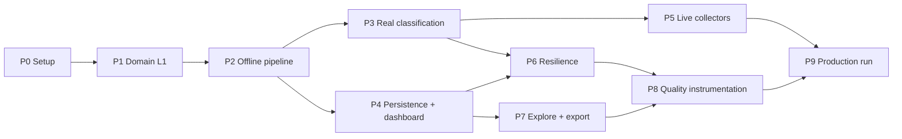

# ReviewLens — Implementation Plan

**Blinkit category-discovery engine.** Build order, work breakdown, and acceptance criteria.

| Document | Answers |
|---|---|
| [`README.md`](README.md) | *What* the engine does, *why* each decision was made, *how to use it* |
| [`architecture.md`](architecture.md) | *How it is built* — components, contracts, control flow, invariants |
| `implementation-plan.md` (this file) | *In what order to build it* — tasks, dependencies, estimates, gates, risks |
| [`edge-cases.md`](edge-cases.md) | *What breaks it* — the failure catalogue each phase must handle, with fixtures |
| [`eval.md`](eval.md) | *How it is measured* — the metrics and thresholds behind each phase gate |

> Tasks marked as hardening implement requirements that do **not** exist in the reference build. They are listed in one place — [README §23, Shipped vs. specified](README.md#23-shipped-vs-specified).

---

## Table of contents

- [How to read this plan](#how-to-read-this-plan)
- [Delivery shape](#delivery-shape)
- [Dependency graph & critical path](#dependency-graph--critical-path)
- [Schedule](#schedule)

**Phases**

- [Phase 0 — Project setup & guardrails](#phase-0--project-setup--guardrails)
- [Phase 1 — Domain skeleton (L1)](#phase-1--domain-skeleton-l1)
- [Phase 2 — Offline pipeline on a seed corpus](#phase-2--offline-pipeline-on-a-seed-corpus)
- [Phase 3 — Real classification](#phase-3--real-classification)
- [Phase 4 — Persistence & dashboard](#phase-4--persistence--dashboard)
- [Phase 5 — Live collectors](#phase-5--live-collectors)
- [Phase 6 — Resilience & economics](#phase-6--resilience--economics)
- [Phase 7 — Exploration & export](#phase-7--exploration--export)
- [Phase 8 — Quality instrumentation & validation](#phase-8--quality-instrumentation--validation)
- [Phase 9 — First production run & monthly cadence](#phase-9--first-production-run--monthly-cadence)

**Supporting plans**

- [Data & asset preparation](#data--asset-preparation)
- [Quality gates](#quality-gates)
- [Risk register](#risk-register)
- [Environment & access checklist](#environment--access-checklist)
- [Operating runbook](#operating-runbook)
- [Explicitly out of scope](#explicitly-out-of-scope)

---

## How to read this plan

### Task IDs
`P{phase}-T{nn}` — e.g. `P3-T04`. Stable identifiers; reference them in commits and PRs.

### Effort units
Estimates are **ideal engineer-days** (uninterrupted focus, no meetings, no context switching). Multiply by ~1.4 for calendar time. They assume one engineer comfortable with TypeScript and Next.js, and one PM available for taxonomy decisions.

### Definition of Done — applies to every task
1. Code merged to main behind whatever flag it needs.
2. Tests written at the level named in the phase's test section, passing in CI.
3. Any invariant the task touches (see [`architecture.md` §5.4](architecture.md)) has an assertion or property test.
4. If the task changes a contract, the corresponding section of `architecture.md` is updated in the same PR.
5. No `TODO` left in the diff without a linked issue.

### Phase gates
Each phase ends with **exit criteria**. These are gates, not suggestions. Proceeding past a failed gate is how you end up debugging a collector while the taxonomy is still wrong — the most expensive failure mode available, because taxonomy changes invalidate the entire classification cache ([`architecture.md` ADR-009](architecture.md)).

### The load-bearing sequencing decision
**L1 domain config first, live collectors near-last.** Collectors are the highest-maintenance and lowest-conceptual-risk component; the taxonomy is the opposite. Building collectors first feels productive and produces a pile of reviews you cannot yet analyse. Building the taxonomy first means every later phase has a stable target — and when the flakiest component finally arrives, the pipeline behind it is already proven.

---

## Delivery shape

Ten phases. Every one ends in something you can demonstrate.

| Phase | Outcome you can show | Ideal days |
|---|---|---|
| P0 | Repo, CI, import linter, env scaffold | 2 |
| P1 | `formatTaxonomyForPrompt()` printing the complete Blinkit prompt block | 4 |
| P2 | `npm run analyze` producing a full six-question report offline, zero API calls | 6 |
| P3 | 100 real Blinkit reviews classified end-to-end with accurate cost prediction | 5 |
| P4 | A persisted run reopening at a stable URL, with shell, evidence drawer, and deep links | 9 |
| P5 | Seven-source live fetch with per-source keep rates | 10 |
| P6 | Interrupted run resuming from cache with zero re-spend | 5 |
| P7 | Any dashboard number drilled to its supporting reviews in ≤2 clicks; all seven exports | 7 |
| P8 | A deliberately weak corpus self-reporting a low readiness score with correct gaps | 5 |
| P9 | First production run + a repeatable monthly cadence | 4 |
| | **Total** | **55** |

**Walking skeleton.** P0→P2 (12 days) is the walking skeleton: a real Blinkit corpus in, a real six-question report out, no LLM spend, no infrastructure. If the project is going to be wrong about something fundamental, it will be visible here — and this is the cheapest point at which to be wrong.

---

## Dependency graph & critical path



**Critical path:** `P0 → P1 → P2 → P3 → P6 → P8 → P9` = **31 ideal days.**

**Parallelizable off the critical path:**
- **P4 (persistence + dashboard)** can start as soon as P2 emits a stable `Aggregation` + `ExecutiveReport` shape. It does not need a real classifier — mock output renders identically.
- **P5 (collectors)** can start as soon as P3 proves the classifier, and runs fully independently of P4/P6/P7.
- **P7 (explore + export)** needs only P4.

**Two-engineer split:** Engineer A takes the critical path (P0→P1→P2→P3→P6→P8). Engineer B takes P4→P7, then P5. They converge at P9. This lands in roughly **6 calendar weeks** versus ~10 solo.

---

## Schedule

Calendar estimates include the 1.4× overhead multiplier.

| Week | Solo | Two engineers |
|---|---|---|
| 1 | P0, P1 | A: P0, P1 · B: (design/UI prep, corpus sourcing) |
| 2 | P2 | A: P2 · B: P2 support, seed-corpus build |
| 3 | P2, P3 | A: P3 · B: P4 |
| 4 | P3, P4 | A: P3, P6 · B: P4, P7 |
| 5 | P4 | A: P6 · B: P7, P5 |
| 6 | P4, P5 | A: P8 · B: P5 → **converge, P9** |
| 7 | P5 | — |
| 8 | P6, P7 | — |
| 9 | P7, P8 | — |
| 10 | P8, P9 | — |

---

# Phase 0 — Project setup & guardrails

**Goal.** A repository where the architecture's layering rules are mechanically enforced from the first commit, not retrofitted after they've been violated.

**Entry criteria.** None.

### Tasks

| ID | Task | Files / artifacts | Est. |
|---|---|---|---|
| P0-T01 | Scaffold Next.js (App Router) + TypeScript strict + Tailwind | `next.config.js`, `tsconfig.json`, `tailwind.config.ts` | 0.25 |
| P0-T02 | Directory skeleton matching README §21 | `app/`, `lib/`, `components/`, `data/` | 0.25 |
| P0-T03 | Lint, format, typecheck; CI running all three on PR | `.eslintrc`, `.prettierrc`, `.github/workflows/ci.yml` | 0.5 |
| P0-T04 | **Import linter enforcing L1–L5 dependency rules** | `.eslintrc` (`import/no-restricted-paths`) | 0.5 |
| P0-T05 | Test runner + coverage baseline | `vitest.config.ts` | 0.25 |
| P0-T06 | `.env.example` with every variable from README §17 | `.env.example` | 0.25 |
| P0-T07 | Material 3 token layer (light/dark, surface/on-surface scales) | `app/globals.css`, Tailwind theme | — folded into P4 |

### P0-T04 in detail — the rule that pays for itself

Encode the four dependency rules from [`architecture.md` §3](architecture.md) as lint errors:

```jsonc
// L1 imports nothing from the app
{ "target": "./lib/{taxonomy,research-questions,categories}.ts", "from": "./{app,components}" },
// L2 domain logic never imports transport or UI
{ "target": "./lib/!(taxonomy|research-questions|categories).ts", "from": "./app/api" },
{ "target": "./lib", "from": "./components" },
// L4 orchestrator never imports L2 directly — it must go over HTTP
{ "target": "./app/page.tsx", "from": "./lib/!(types|llm/limits)" }
```

The last rule is the important one. Without it, someone will import `classify()` directly into the client component during a debugging session, and the API key will follow it into the browser bundle. A lint rule catches that in seconds; a security review catches it in weeks.

### Tests
Smoke only: CI green on an empty scaffold.

### Exit criteria
- [ ] `npm run build && npm run test && npm run lint` all pass in CI on a clean checkout
- [ ] A deliberately illegal import (client importing `lib/llm/client.ts`) **fails lint**
- [ ] `.env.example` documents every variable, with the mock-mode path working with none of them set

---

# Phase 1 — Domain skeleton (L1)

**Goal.** The complete Blinkit taxonomy, encoded once, generating its own prompt block.

**Entry criteria.** P0 complete.

> **This is the highest-leverage phase in the plan.** Every later phase imports L1. Getting the taxonomy wrong and discovering it in P8 means a full-corpus reclassification and a cache flush — days of wall time and the entire token budget. Spend the PM time here.

### Tasks

| ID | Task | Files | Est. |
|---|---|---|---|
| P1-T01 | Six research question IDs + labels + `formatResearchQuestionsForPrompt()` | `lib/research-questions.ts` | 0.25 |
| P1-T02 | All eight taxonomy arrays (themes ±, barriers, behaviors, emotions, segments, root causes, unmet needs) | `lib/taxonomy.ts` | 1.0 |
| P1-T03 | Meaning-string maps for themes / barriers / root causes | `lib/taxonomy.ts` | 0.75 |
| P1-T04 | `ROOT_CAUSE_IMPLICATIONS` + `UNMET_NEED_INTERVENTIONS` | `lib/taxonomy.ts` | 0.5 |
| P1-T05 | Guards: `isPositiveTheme`, `isNegativeTheme`, `isRootCauseEligibleReview`; `OTHER_UNKNOWN_LABELS`; `NON_RESEARCH_FALLBACK` | `lib/taxonomy.ts` | 0.25 |
| P1-T06 | `formatTaxonomyForPrompt()` — including detection signals, anti-lazy-label pressure, segment tie-breaks | `lib/taxonomy.ts` | 0.5 |
| P1-T07 | Blinkit category list for `mentioned_categories[]` normalization | `lib/categories.ts` | 0.25 |
| P1-T08 | Exploration keyword prefilter | `lib/collectors/keyword-filter.ts` | 0.25 |
| P1-T09 | `GENERIC_BLOCKLIST` + `BUILDABLE` regexes in commerce vocabulary | `lib/taxonomy.ts` | 0.25 |
| P1-T10 | **Taxonomy review session with the PM** | — | 0.5 (+PM time) |

### P1-T02/T03 in detail

Source content is [`README.md` §9](README.md) — it is written to be transcribed directly. Every label needs a meaning string, because the meaning strings *are* the finding narratives ([`architecture.md` P5](architecture.md)); a label without one produces a broken sentence on the dashboard.

Two constraints the tests will enforce:
- Positive and negative theme sets are **disjoint**.
- Every member of `OTHER_UNKNOWN_LABELS` appears in exactly one taxonomy array.

### P1-T07 in detail — the category list

`lib/categories.ts` holds Blinkit's actual category taxonomy (groceries, fresh produce, dairy, snacks, beverages, personal care, cosmetics, baby care, pet supplies, household/cleaning, home & kitchen, electronics accessories, stationery, pharmacy/wellness, …) plus a synonym map for normalization — `dog food → pet supplies`, `diapers → baby care`, `shampoo → personal care`.

This list is **not a classification label**. It exists solely to normalize the open `mentioned_categories[]` field into something countable. Keep it separate from the taxonomy so that adding a category never invalidates the classification cache.

### P1-T10 in detail — the review session

Ninety minutes with the PM, before a single review is classified. Walk every label and ask three questions:

1. **Can two reasonable people assign this label the same way?** If not, the boundary is wrong — merge the labels or sharpen the meaning string.
2. **If this came back as the #1 finding, would we know what to do?** If not, the label is a symptom, not a mechanism. Push it down into a theme and put the mechanism in root causes.
3. **Does the segment set actually differ in experimentation propensity?** That is what research question 5 asks. Segments that don't differ on that axis are decoration.

Capture decisions as comments in `taxonomy.ts`. In six months, "why is Deal Seeker separate from Habitual Replenisher?" will be asked, and the answer needs to be in the file.

### Tests

| Test | Assertion |
|---|---|
| Array integrity | All eight arrays non-empty, no duplicates within an array |
| Disjointness | `POSITIVE_THEMES ∩ NEGATIVE_THEMES = ∅` |
| Meaning coverage | Every theme/barrier/root cause has a meaning string |
| Intervention coverage | Every root cause has an implication; every unmet need has an intervention |
| Unknown registry | Every `OTHER_UNKNOWN_LABELS` member exists in exactly one array |
| Prompt completeness | `formatTaxonomyForPrompt()` output contains every label verbatim |
| Prompt budget | Prompt block ≤ ~1,800 tokens (the input-token assumption in the cost model) |
| Prefilter sanity | Fixture of 20 hand-written reviews: 10 must pass, 10 must fail |

The **prompt-completeness test is the one that matters most.** It is the mechanical guarantee that the prompt and the validator cannot drift — the failure mode that silently breaks LLM pipelines.

### Exit criteria
- [ ] `formatTaxonomyForPrompt()` prints a complete, human-readable prompt block; a PM can read it and agree it describes the research
- [ ] All L1 tests pass
- [ ] PM has signed off on the taxonomy (P1-T10)
- [ ] Prompt block within token budget

### Risks
| Risk | Mitigation |
|---|---|
| Taxonomy churn after classification begins | The P1-T10 gate exists precisely to prevent this. After P3, a taxonomy change costs a full cache flush and reclassification |
| Labels too abstract to assign consistently | Detection signals per mechanism (P1-T06) are the fix — they convert an abstract label into a matchable phrase |

---

# Phase 2 — Offline pipeline on a seed corpus

**Goal.** Real Blinkit reviews in, a complete six-question research report out — with zero API calls and zero infrastructure.

**Entry criteria.** P1 exit criteria met.

> **Blinkit-specific dependency:** unlike the pilot, there is no bundled corpus. P2-T01 builds one, and it blocks everything else in this phase.

### Tasks

| ID | Task | Files | Est. |
|---|---|---|---|
| P2-T01 | **Build the seed corpus** — ~300 real Blinkit reviews, hand-collected across all five source types | `data/seed-corpus.csv` | 1.0 |
| P2-T02 | CSV/JSON loader with header auto-detection | `lib/ingest/parse.ts` | 0.5 |
| P2-T03 | Normalization pipeline (6 steps, order-dependent) | `lib/curate.ts` | 0.5 |
| P2-T04 | Dedupe (exact + near-duplicate, cross-source) | `lib/collectors/dedupe.ts` | 0.5 |
| P2-T04b | Deterministic length floor → `too_short`, before any LLM call | `lib/curate.ts` | 0.25 |
| P2-T05 | Curation partition + `records[]` audit trail + stats | `lib/curate.ts` | 0.5 |
| P2-T06 | **Mock classifier** — deterministic, taxonomy-valid, seeded by review hash | `lib/llm/mock.ts` | 0.5 |
| P2-T07 | Aggregation: distributions, cross-tabs, quote clusters, source distribution, category mentions | `lib/aggregate.ts` | 1.0 |
| P2-T08 | Findings: narrative grammar + six answers + evidence attachment | `lib/findings.ts` | 0.75 |
| P2-T09 | Synthesis: domain routing, mechanism clustering, severity, opportunity scoring, validation gate, readiness | `lib/synthesis.ts` | 1.25 |
| P2-T10 | CLI: `npm run analyze -- <file>` printing the full report | `scripts/analyze.ts` | 0.25 |
| P2-T11 | **Gold set v1** — 100 human-labeled reviews | `data/gold-set.json` | 1.0 (PM/analyst) |

*(T01 and T11 run in parallel with engineering work; the day counts overlap.)*

### P2-T01 in detail — the seed corpus

Roughly 300 reviews, deliberately **over-sampled for exploration relevance** — this corpus exists to exercise the pipeline, not to be representative. Target mix:

| Source | Count | How |
|---|---|---|
| Play Store | ~80 | Manual export / one-off script |
| App Store | ~50 | Manual collection |
| Reddit | ~90 | Quick-commerce threads in `r/india`, `r/bangalore`, `r/mumbai`, `r/delhi` |
| Forums | ~40 | Consumer complaint portals |
| Social | ~40 | Public X/Twitter posts |

**Include, deliberately:** at least 30 reviews that are delivery complaints *with* a shopping-behaviour signal (the mixed reviews Filter 2 must keep), at least 20 pure-noise reviews (must be dropped), at least 20 Hinglish / code-mixed reviews (to measure what is currently lost), and at least 15 competitor-comparison reviews.

Schema: `source,text,rating,date,city,url`. This file is versioned in the repo and becomes the regression fixture for every later phase.

### P2-T06 in detail — the mock classifier

Not random. Hash the review text to a stable seed and derive taxonomy-valid labels deterministically, with a plausible confidence distribution. Requirements:

- Same input → same output, always. Otherwise P2's tests flake and the P3 regression baseline is worthless.
- Emits the **full** `ClassifiedReview` shape including `classification_reasons` and `mentioned_categories`.
- Configurable label skew, so you can generate a deliberately weak corpus for the P8 readiness test.

### P2-T09 in detail — synthesis

The largest single task in the plan. Build it in the pipeline order from [`architecture.md` P6](architecture.md): route → cluster → score → narrate → findings → opportunities → gate → assemble → grade. Each sub-step is independently testable; do not proceed to the next until the previous has a table-driven test.

The **validation gate** is where reviewers will push back ("why did we throw away an opportunity?"). Retain rejections with reasons from the first commit — it is much harder to add the audit trail afterwards.

### Tests

| Level | Coverage |
|---|---|
| Unit | Normalization steps individually; dedupe on near-duplicate fixtures |
| Unit | `buildDistribution`, `buildCrossTab` against hand-computed golden fixtures over a 20-row corpus |
| Unit | Opportunity scoring — table-driven, including boundaries at 25 and 60 |
| Unit | Readiness rubric — each of the five checks reachable, each gap string correct |
| Unit | Validation gate — every `GENERIC_BLOCKLIST` entry rejects; buildable/non-buildable pairs |
| Property | **All ten invariants from `architecture.md` §5.4**, over the seed corpus |
| Integration | Full pipeline on `seed-corpus.csv`, snapshot the report |

**Every invariant should be testable at the end of this phase.** That is the phase's real purpose.

### Exit criteria
- [ ] `npm run analyze -- data/seed-corpus.csv` prints distributions, six findings, scored opportunities, and a readiness score — entirely offline
- [ ] All ten invariants asserted and passing
- [ ] Curation `records[]` accounts for every input review with an exclusion reason
- [ ] Gold set v1 exists, versioned, with per-field labels
- [ ] A deliberately generic opportunity is rejected with the correct reason string

### Risks
| Risk | Mitigation |
|---|---|
| Seed corpus too clean → pipeline untested on real noise | The deliberate inclusion quotas above |
| Gold set derived from model output (circular) | Build it in P2, *before* the real classifier exists. Non-negotiable |
| Synthesis complexity underestimated | It is the largest task here; if it slips, cut opportunity *sorting* options, never the validation gate |

---

# Phase 3 — Real classification

**Goal.** Replace the mock with a real LLM, and predict its cost accurately before spending it.

**Entry criteria.** P2 exit criteria met. LLM API key provisioned.

### Tasks

| ID | Task | Files | Est. |
|---|---|---|---|
| P3-T01 | Groq Llama provider adapter, model resolution (`llama-3.3-70b-versatile` default) | `lib/llm/client.ts` | 0.5 |
| P3-T02 | Limits, batch sizing, cooldown, batch delay, token estimator | `lib/llm/limits.ts` | 0.75 |
| P3-T03 | Prompt assembly from L1 formatters | `lib/llm/prompts.ts` | 0.5 |
| P3-T04 | Parse + validate + `coerce()` with logging | `lib/llm/classify.ts` | 0.75 |
| P3-T05 | Retry taxonomy: recoverable vs fatal; truncation → halve batch | `lib/llm/classify.ts` | 0.75 |
| P3-T06 | `POST /api/classify` + `GET /api/classify/config` | `app/api/classify/**` | 0.5 |
| P3-T07 | `POST /api/curate-reviews` — real LLM relevance judgment | `app/api/curate-reviews/route.ts` | 0.5 |
| P3-T08 | Client batching loop with progress + throttle | `app/page.tsx` | 0.5 |
| P3-T09 | Mock-mode toggle wired through config | `lib/llm/*`, `app/api/classify/config` | 0.25 |

### P3-T04 in detail — parse and validate

Three failure classes, three distinct responses — never blur them:

| Failure | Response |
|---|---|
| Invented / paraphrased label | `coerce()` → exact → case-insensitive → trimmed → fallback. **Log every coercion beyond exact.** |
| Truncated JSON | `LlmOutputTruncatedError` → halve batch size, retry |
| Length mismatch (`arr.length !== inputs.length`) | Fail the batch, retry. **Never realign by index** — that attaches labels to the wrong reviews, aggregates perfectly, and is silently wrong |

The coercion rate is a live quality signal. Emit it as a metric; a rising rate means the prompt has drifted from the arrays or the model has started paraphrasing.

### P3-T05 in detail — retry taxonomy

From [`architecture.md` P3](architecture.md). The distinction that saves hours: **per-minute limits are recoverable, per-day limits are fatal.** Retrying a daily-quota error four times burns 4× the wall clock to fail identically.

### Tests

| Level | Coverage |
|---|---|
| Contract | Recorded real completions, plus adversarial: truncated, wrong length, invented labels, code-fenced, trailing prose |
| Unit | Token estimator vs. recorded actuals — assert within ±15% |
| Unit | `isRecoverable()` table — every error class routed correctly |
| Fault injection | Forced 429 recovers; forced truncation halves and completes; forced daily-quota stops immediately |
| Eval | Classify the gold set; per-field agreement against README §16.8 thresholds |

### Exit criteria
- [ ] 100 real Blinkit reviews classified end-to-end
- [ ] Token estimate within **±15%** of actual spend
- [ ] Forced 429 recovers; forced truncation completes at a smaller batch; forced daily-quota stops without retrying
- [ ] Gold-set agreement meets thresholds: `exploration_relevant` ≥90%, `theme` ≥80%, `root_cause` ≥70%
- [ ] Coercion rate < 5% of classified fields
- [ ] Mock mode still produces an identical-shaped report (P2 regression suite green)

### Risks
| Risk | Mitigation |
|---|---|
| Gold-set agreement below threshold | Do **not** proceed. Diagnose via `classification_reasons`: if the model is confused, sharpen detection signals; if the *boundary* is ambiguous, fix the taxonomy — and accept the cache flush now, while it is cheap |
| Hinglish reviews classify poorly | Expected. Measure it explicitly against the code-mixed slice of the gold set and record the number. It is the baseline for the roadmap's translation pass |
| Batch size 10 truncates | Start at 3. Raise only after confirming no truncation |

---

# Phase 4 — Persistence & dashboard

**Goal.** A run survives, reopens at a stable URL, and every claim on screen expands into its evidence.

**Entry criteria.** P2 complete (P3 not required — mock output renders identically).

### Tasks

| ID | Task | Files | Est. |
|---|---|---|---|
| P4-T01 | Turso schema + migrations | `lib/db/schema.ts`, `lib/db/client.ts` | 0.5 |
| P4-T02 | Run persistence + load; `taxonomy_version` stamping | `lib/db/runs.ts` | 0.75 |
| P4-T03 | `POST /api/runs`, `GET /api/runs/{id}` | `app/api/runs/**` | 0.5 |
| P4-T04 | Material 3 token layer, light + dark | `app/globals.css` | 0.5 |
| P4-T05 | Dashboard shell: header counts, KPI tiles, section layout | `app/runs/[id]/page.tsx` | 0.75 |
| P4-T06 | Executive report section (summary, findings, confidence bands) | `components/report/*` | 1.0 |
| P4-T07 | Corpus evidence section: distributions, ranked barriers, cross-tabs | `components/evidence/*` | 1.0 |
| P4-T08 | Root-cause diagnosis + product opportunities cards | `components/opportunities/*` | 0.75 |
| P4-T09 | Quote chips with source, segment, confidence, expand-to-full | `components/QuoteChip.tsx` | 0.5 |
| P4-T10 | Source + confidence filters (client-side projections) | `app/runs/[id]/page.tsx` | 0.5 |
| P4-T11 | `/history` repository list | `app/history/page.tsx` | 0.25 |
| P4-T12 | **App shell**: sidebar nav, New-analysis action, 3-step stepper, scroll FABs | `app/layout.tsx`, `components/Shell.tsx` | 0.5 |
| P4-T13 | **Evidence drawer** — full classified set, count, mean confidence, source chips | `components/EvidenceDrawer.tsx` | 0.5 |
| P4-T14 | **Per-label deep links** — *Open all reviews for {label}*; root-cause detail view | `components/*`, quote-explorer query params | 0.5 |
| P4-T15 | **Demo-mode control** + `mock` stamping and dashboard badge | `components/DemoToggle.tsx`, `lib/db/runs.ts` | 0.5 |

### P4-T02 in detail — stamp the version

`taxonomy_version` is the field most teams omit and most regret. Without it, a run from before a taxonomy change is silently incomparable to one after it, and `/runs/compare` will happily diff two incompatible label spaces. Stamp it on write; guard on it in P7.

Store computed `aggregation` and `findings` **inline** in the run. Reproducibility beats normalization: a run must open identically in a year even if the aggregation code changed underneath it.

### P4-T10 in detail — filters are projections, not queries

Source and confidence filters operate on already-loaded rows in the browser. Instant, and provably consistent with what was persisted. Do not re-query or re-aggregate — that reintroduces the possibility of the screen disagreeing with the saved run.

### Tests

| Level | Coverage |
|---|---|
| Unit | Run round-trip: persist → load → deep-equal |
| Unit | Write-time check that every quote `review_id` resolves (invariant I8) |
| Component | Dashboard renders from a fixture run with no network |
| E2E | Analyze → persist → reload page → identical render |

### Exit criteria
- [ ] A run survives a full page reload and renders identically
- [ ] Two runs listed in `/history` with correct, self-describing provenance
- [ ] Every finding, root cause, and opportunity card exposes its supporting quotes
- [ ] Confidence filter visibly changes what survives on screen
- [ ] `taxonomy_version` present on every persisted run
- [ ] Evidence drawer lists the **full** classified set with source-distribution chips
- [ ] Every label offers *Open all reviews for {label}* and lands on a pre-filtered explorer
- [ ] A mock run is stamped, badged un-dismissably, and the badge survives print CSS

---

# Phase 5 — Live collectors

**Goal.** Five working sources with honest per-source yield reporting.

**Entry criteria.** P3 complete (a classifier exists to consume the output).

> Highest-maintenance, lowest-conceptual-risk phase. Budget for breakage as ongoing cost, not a one-time build.

### Tasks

| ID | Task | Files | Est. |
|---|---|---|---|
| P5-T01 | `Collector` interface + registry + async-iterable contract | `lib/collectors/{types,index}.ts` | 0.5 |
| P5-T02 | Play Store collector (sort, region, minRating) | `lib/collectors/playstore.ts` | 1.0 |
| P5-T03 | App Store collector (SSR pages, IN storefront) | `lib/collectors/appstore.ts` | 1.25 |
| P5-T04 | Reddit collector — posts **and** comments as first-class docs | `lib/collectors/reddit.ts` | 1.25 |
| P5-T05 | Consumer/community forums collector | `lib/collectors/forums.ts` | 1.0 |
| P5-T06 | Social collector (X / public posts) | `lib/collectors/social.ts` | 1.0 |
| P5-T06b | **Product-reviews collector** — SKU-level PDP and marketplace listing reviews, breadth-first across categories | `lib/collectors/product-reviews.ts` | 1.25 |
| P5-T06c | **Quick-commerce discussions collector** — industry threads, comparison-article and video comment sections | `lib/collectors/quickcommerce.ts` | 1.0 |
| P5-T07 | Politeness: concurrency caps, delays, honest `User-Agent`, page ceilings | `lib/collectors/*` | 0.5 |
| P5-T08 | `POST /api/fetch-reviews` + merge + cross-source dedupe + per-source stats | `app/api/fetch-reviews/route.ts` | 0.5 |
| P5-T09 | Fetch UI: source chips, amount slider, region/sort/rating, pre-flight estimate | `app/page.tsx` | 1.0 |

### P5-T06b in detail — product reviews are structurally different

Every other collector returns text *about the app*. This one returns text *about a product in a category* — which makes it the densest available evidence for `Quality Uncertainty`, `Information Gap Blocks Trust`, and the category trust map.

Two consequences for the collector design:

- **Collect breadth-first across categories, not depth-first on bestsellers.** Fifty reviews each across pet supplies, baby care, personal care, and fresh produce is far more useful than 500 reviews of the top-selling atta. The research question is about unfamiliar categories; bestsellers are by definition familiar.
- **`mentioned_categories` is deterministic here**, derived from the listing rather than inferred from text. Product-review rows are therefore the anchor that calibrates category inference on every other source.

### P5-T04 in detail — Reddit is the most valuable collector

It supplies the mechanism-level evidence the whole synthesis layer depends on. Two requirements:

- **Comments are first-class documents**, not appendages to a post. The best evidence in this corpus is frequently a comment three levels deep in a thread about something else.
- **Subreddit list is configuration**, not code: `r/india`, `r/bangalore`, `r/mumbai`, `r/delhi`, `r/hyderabad`, `r/pune`, plus consumer/personal-finance subs. It will need tuning after the first real run.

### P5-T08 in detail — alert on yield, not on errors

The dangerous collector failure is **silent yield decay**: HTTP 200, zero parseable reviews, indistinguishable from "no matching reviews found". Per-source counts must be surfaced to the operator on every fetch, and logged per run so a drop is visible across runs.

### Tests

| Level | Coverage |
|---|---|
| Contract | Recorded HTML/JSON fixtures per source; assert field mapping **and yield count** |
| Unit | Cross-source dedupe on a known cross-posted pair |
| Integration | One collector throwing → run degrades with fewer sources, does not fail |
| Manual | Live smoke against each source, recording actual keep rate |

### Exit criteria
- [ ] Seven-source live fetch produces a corpus with a plausible per-source keep rate (Play Store ~5–15%)
- [ ] Killing one collector degrades rather than fails the run
- [ ] Per-source yield displayed in the UI and persisted in the run row
- [ ] Rate limiting verified: no source returns 429 during a full-size fetch
- [ ] ToS review completed and recorded for each source

### Risks
| Risk | Mitigation |
|---|---|
| A source blocks scraping outright | Identified during the ToS review, before build. Drop the source and note the evidence-strength impact rather than working around a block |
| Markup changes mid-project | Fixture-based contract tests catch it in CI; yield alerting catches it in production |
| Over-fetching | Hard page ceilings (P5-T07) |

---

# Phase 6 — Resilience & economics

**Goal.** Long runs survive interruption, and no token is ever spent twice.

**Entry criteria.** P3 and P4 complete.

### Tasks

| ID | Task | Files | Est. |
|---|---|---|---|
| P6-T01 | Classification cache: content-hash key, write-through, `POST /api/classify/cache` | `lib/db/cache.ts`, `app/api/classify/cache/route.ts` | 1.0 |
| P6-T02 | Pipeline state machine (all nine states) wired to UI predicates | `app/page.tsx` | 0.75 |
| P6-T03 | `curation_empty` state with remediation guidance + countdown | `components/CurationEmpty.tsx` | 0.5 |
| P6-T04 | Pre-flight estimator surfaced + quota guard blocking over-budget runs | `app/page.tsx` | 0.5 |
| P6-T05 | Split planner (2–5 way) + `POST /api/runs/queue` | `lib/split.ts`, `app/api/runs/queue/route.ts` | 0.75 |
| P6-T06 | Save-for-later (persist curated corpus as a queued run) | `app/page.tsx`, `lib/db/runs.ts` | 0.5 |
| P6-T07 | Partial dashboard from cache, with the ≥10 threshold | `app/page.tsx` | 0.5 |
| P6-T08 | Cache-flush script + taxonomy-hash mismatch warning at startup | `scripts/flush-cache.ts` | 0.5 |

### P6-T08 in detail — the sharpest edge in the system

Cache keys deliberately exclude taxonomy version, so routine label tweaks don't silently 10× the bill ([`architecture.md` ADR-009](architecture.md)). The cost of that choice: **forgetting to flush after a taxonomy change produces a mixed-taxonomy corpus that aggregates cleanly and is completely wrong.**

Mitigate with both halves:
1. A one-command flush script.
2. A startup check comparing the deployed taxonomy hash against the newest cache entry's, warning loudly on mismatch.

Do not skip the second. The first depends on someone remembering.

### Tests

| Level | Coverage |
|---|---|
| Unit | Cache key stability across re-batching |
| Integration | Interrupt mid-run → resume → **zero additional API calls for cached rows** |
| Integration | Over-quota corpus → split into parts → each completes independently |
| Unit | `cached < 10` refuses the partial dashboard |
| Unit | Taxonomy-hash mismatch triggers the warning |

### Exit criteria
- [ ] An interrupted run resumes from cache with **zero re-spend** (verified by request count, not by feel)
- [ ] An over-quota corpus splits and completes across two days
- [ ] Zero-relevant-review corpus lands in `curation_empty`, never an empty dashboard
- [ ] Cache flush script works; hash-mismatch warning fires on a simulated taxonomy change

---

# Phase 7 — Exploration & export

**Goal.** Every number is interrogable; every artifact is portable.

**Entry criteria.** P4 complete.

### Tasks

| ID | Task | Files | Est. |
|---|---|---|---|
| P7-T01 | Quote explorer — free-text `search` + five filters, options seeded from run-present labels | `app/runs/[id]/quotes/page.tsx`, `app/api/quotes/route.ts` | 1.0 |
| P7-T02 | Run comparison + **`taxonomy_version` equality guard** | `app/runs/compare/page.tsx`, `app/api/runs/compare/route.ts` | 1.0 |
| P7-T03 | Assistant: grounding declaration, reviews-in-context count, suggested prompts, `review_id` citations | `app/api/chat/route.ts`, `components/Assistant.tsx` | 1.25 |
| P7-T04 | Print stylesheet + `data-dashboard-no-print` → Dashboard PDF | `app/globals.css`, `lib/export.ts` | 0.75 |
| P7-T05 | **Reports group** — Markdown report, JSON data, Classified CSV (with formula-injection escaping) | `lib/export.ts` | 1.0 |
| P7-T06 | **PM research group** — `formatExecutiveReportMarkdown()` + MD / JSON / PDF variants | `lib/export-pm.ts` | 1.0 |
| P7-T07 | Export provenance header on all seven (dataset, run id, taxonomy version, readiness, `⚠ SYNTHETIC DATA`) | `lib/export*.ts` | 0.25 |
| P7-T08 | Category mention map panel | `components/CategoryMentions.tsx` | 0.5 |
| P7-T09 | Actionable-findings slide view | `components/Slides.tsx` | 0.5 |

### P7-T05 / P7-T06 in detail — two serializers, not one with a flag

The *Reports* group and the *PM research* group answer different questions for different readers ([`architecture.md` P8](architecture.md)). They diverge in content, ordering, and voice.

Building one serializer with a `mode` flag looks economical for about a week, after which every difference between the two audiences becomes a conditional branch inside a single function, and neither output can be changed without regression-testing the other. Build `lib/export.ts` and `lib/export-pm.ts` as separate modules over a shared provenance header.

### P7-T02 in detail — the guard is the feature

`/runs/compare` is what makes this a **monthly tracking instrument** rather than a one-off study. It is also the surface where a taxonomy change silently corrupts conclusions: diffing a pre-change run against a post-change run compares two different label spaces and reports the difference as a trend.

Refuse the comparison when `taxonomy_version` differs. Say why.

### P7-T03 in detail — chat must cite

Ground responses in the run's classified rows and require `review_id` citations in the output. An ungrounded chat answer looks exactly like a grounded one, which would undermine the traceability property the entire system exists to provide.

### Tests

| Level | Coverage |
|---|---|
| Unit | Quote filter intersection logic |
| Unit | Compare guard rejects mismatched `taxonomy_version` |
| Unit | Markdown/CSV serializers against golden output |
| E2E | Dashboard number → drill to supporting reviews in ≤2 clicks |
| Manual | PDF export matches the screen |

### Exit criteria
- [ ] Any dashboard statistic reaches its supporting reviews in ≤ 2 clicks via its *Open all reviews* link
- [ ] Compare refuses mismatched taxonomy versions with a clear message
- [ ] **All seven exports** produce valid output; PDF matches screen; CSV survives a round-trip through a spreadsheet with no formula execution
- [ ] PM report contains **only** the synthesis layer, in presentation order, and is visibly distinct from the Markdown report
- [ ] Every export carries dataset, run id, taxonomy version, readiness score — and `⚠ SYNTHETIC DATA` when mock
- [ ] Assistant declares scope, reports reviews-in-context, and carries resolvable `review_id` citations
- [ ] Quote explorer free-text search returns expected hits; filter options contain only run-present labels

---

# Phase 8 — Quality instrumentation & validation

**Goal.** The system reports honestly on its own output — and you have measured that it does.

**Entry criteria.** P6 and P7 complete.

### Tasks

| ID | Task | Files | Est. |
|---|---|---|---|
| P8-T01 | Evidence-strength grading surfaced per finding | `lib/synthesis.ts`, `components/report/*` | 0.5 |
| P8-T02 | Director-readiness score + gap text on the dashboard | `components/Readiness.tsx` | 0.5 |
| P8-T03 | Validator rejection reporting (count + reasons) | `components/Rejections.tsx` | 0.5 |
| P8-T04 | Confidence histogram per run | `components/ConfidenceHistogram.tsx` | 0.5 |
| P8-T05 | Structured logging: per-batch latency/tokens/retries, cache hit ratio, coercion rate | `lib/llm/*`, `lib/db/*` | 0.75 |
| P8-T06 | Run-row metrics: curation funnel, `excludedByCategory`, readiness, source mix | `lib/db/runs.ts` | 0.5 |
| P8-T07 | **Cross-run stability harness** — same corpus twice, cache off, report deltas | `scripts/stability.ts` | 0.75 |
| P8-T08 | **Spot-check tooling** — sample N per label, record agreement | `scripts/spot-check.ts` | 0.5 |
| P8-T09 | Drift alarms: curation keep-rate and mean confidence vs. rolling baseline | `lib/observability.ts` | 0.5 |

### P8-T07 in detail — run this before the first monthly cycle

The protocol from [`README.md` §16.7](README.md): same corpus, cache disabled, twice; compare theme/barrier/segment distributions.

**Why the timing matters.** If a label swings between identical runs, then month-over-month movement in that label is noise — and you will read it as the impact of an intervention. Establish the stability baseline *before* the tracking cadence starts, not after someone has presented a fake win.

Record per-label deltas. Anything swinging more than a few points needs a taxonomy or detection-signal fix.

### P8-T09 in detail — the two numbers to watch

Across comparable runs: **curation keep-rate** and **mean classification confidence**. A drop in either, with no change to the source mix, means the model or the sources changed underneath you. These are the earliest available signals and they cost almost nothing to track.

### Tests

| Level | Coverage |
|---|---|
| Unit | Evidence-strength thresholds (20/3 → Strong, 10/2 → Medium, else Weak) |
| Unit | Readiness rubric — every gap string reachable, max is 8.0 |
| Integration | Deliberately weak corpus (mock skew) → low score with correct gaps |
| Manual | Spot-check on the current run; agreement recorded |

### Exit criteria
- [ ] A deliberately weak corpus produces a low readiness score with **correct, specific** gap text
- [ ] Cross-run stability measured and recorded; unstable labels either fixed or documented as non-trackable
- [ ] Spot-check tooling produces per-field agreement rates
- [ ] Structured logs capture per-batch tokens, retries, cache hit ratio, coercion rate

---

# Phase 9 — First production run & monthly cadence

**Goal.** A real, defensible Blinkit research artifact — and a repeatable process for producing the next one.

**Entry criteria.** P5 and P8 complete.

### Tasks

| ID | Task | Est. |
|---|---|---|
| P9-T01 | Production deploy: Vercel + Turso, env verified, mock mode off | 0.5 |
| P9-T02 | **Full production fetch** — seven sources, sized for ~200 kept reviews (scrape ~4,000–5,000) | 0.5 |
| P9-T03 | Curation review: inspect `excludedByCategory`, confirm nothing valuable is being dropped | 0.5 |
| P9-T04 | Classification run + cost reconciliation against the estimate | 0.5 |
| P9-T05 | **Human spot-check** (README §16.8 protocol, 30 min) | 0.5 |
| P9-T06 | Findings review with the PM; capture taxonomy gaps observed | 0.5 |
| P9-T07 | Export the deck + write the monthly runbook | 0.5 |
| P9-T08 | Schedule the cadence; set the drift-alarm baseline | 0.5 |

### P9-T02 in detail — sizing the first run

From the measured pilot funnel (~4.5% end-to-end survival):

```
~4,500 raw scraped (≈900 × 5 sources)
   → ~250 unique on-topic after prefilter + dedupe
   → ~180 exploration-relevant after curation
   → ~17 min classification, ~49% of the daily token budget
```

Weight toward Reddit and forums. The keep rate is far higher there, and they carry the mechanism-level evidence that determines whether the run clears the readiness bar at all.

### P9-T05 — do not skip this

Thirty minutes. Top 3 themes × 10 random supporting reviews each, then the top root cause and top segment. Target ≥8/10 agreement per theme. Expect `segment` at the low end — a grocery review rarely reveals household composition, which is exactly why segment splits get presented as directional.

### Exit criteria
- [ ] Production run completes and persists
- [ ] Actual cost within ±15% of the pre-flight estimate
- [ ] Director readiness ≥ 6/10 — **or** a documented plan to reach it (usually: more Reddit, larger corpus)
- [ ] Spot-check agreement meets thresholds; results recorded
- [ ] PM has reviewed findings and confirmed they are decision-useful
- [ ] Monthly runbook written and the cadence scheduled

### If readiness comes back low

That is the system working. The gap text names the fix:

| Gap | Action |
|---|---|
| *Limited exploration corpus depth* | Scrape more; weight Reddit and forums higher |
| *Insufficient mechanism-level findings* | Root causes are collapsing to Unclear — strengthen detection signals in L1 |
| *Fewer than 3 strategic opportunities* | Check the rejection list; if rejections are correct, the corpus is too thin |
| Evidence strength all Weak | Single-source concentration — add sources, don't add reviews |

---

# Data & asset preparation

Three assets are not code, are easy to defer, and each blocks a phase. Assign owners in week 1.

| Asset | Phase | Owner | Notes |
|---|---|---|---|
| **Seed corpus** (~300 reviews) | P2-T01 | Analyst | Over-sampled for relevance; includes the deliberate quotas (mixed reviews, pure noise, Hinglish, competitor comparisons) |
| **Gold set** (100 labeled reviews) | P2-T11 | PM + analyst | Built **before** the real classifier exists. Sample across all seven sources *and* across code-mixing — a gold set drawn only from English Play Store reviews certifies a classifier that fails where the real evidence lives |
| **Category list + synonyms** | P1-T07 | PM | Blinkit's real catalog taxonomy; drives `mentioned_categories[]` normalization only |

### Gold set labeling protocol
1. Two labelers work independently on the same 100 reviews.
2. Compare; discuss every disagreement.
3. **Disagreements are taxonomy feedback, not labeler error.** If two informed people can't agree, the boundary is wrong — fix L1.
4. Version the resolved set in the repo. Re-evaluate on every prompt, model, or taxonomy change.

---

# Quality gates

Gates that block the next phase.

| Gate | Where | Threshold |
|---|---|---|
| Taxonomy sign-off | P1 | PM approval recorded |
| Invariants | P2 | All 10 asserted and passing |
| Cost model accuracy | P3 | Estimate within ±15% of actual |
| Classification agreement | P3 | `exploration_relevant` ≥90%, `theme` ≥80%, `root_cause` ≥70% |
| Coercion rate | P3 | < 5% of classified fields |
| Zero re-spend on resume | P6 | Verified by request count |
| Traceability | P7 | Any number → supporting reviews in ≤2 clicks |
| Self-grading correctness | P8 | Weak corpus → low score with correct gaps |
| Cross-run stability | P8 | Per-label deltas recorded; unstable labels fixed or documented |
| Production readiness | P9 | ≥6/10, or a documented path to it |

---

# Risk register

| # | Risk | Likelihood | Impact | Mitigation | Trigger to act |
|---|---|---|---|---|---|
| R1 | **Taxonomy churn after classification starts** | Medium | High — full reclassification + cache flush | P1-T10 gate; PM sign-off before P3 | Any label change proposed after P3 |
| R2 | **Hinglish / code-mixed reviews classify poorly** | High | Medium — distributions skew English-first metro | Measure explicitly on the gold set's code-mixed slice; document the skew on every deck; translation pass is roadmap item #1 | Agreement on the code-mixed slice < 60% |
| R3 | **A source blocks scraping** | Medium | Medium — lower evidence strength | ToS review before build; drop the source and note the impact rather than evading a block | Robots/ToS prohibition, or sustained 403s |
| R4 | **Silent collector yield decay** | High (over time) | High — invisible corpus degradation | Per-source yield in UI, run row, and drift alarm | Yield drops >50% vs. rolling baseline |
| R5 | **Cache not flushed after taxonomy change** | Medium | **Critical — mixed-taxonomy corpus, aggregates cleanly, silently wrong** | Flush script + startup hash-mismatch warning (P6-T08); `taxonomy_version` on runs | Hash mismatch at startup |
| R6 | **Segment inference too weak to support the strategy claim** | High | Medium — the cross-category demand argument rests on Household Manager / Occasion Shopper | Present segment splits as directional; never as the sole basis for a decision | Segment agreement < 60% |
| R7 | **First run scores low on readiness** | Medium | Low — the system is telling you the truth | Size the corpus per the pilot funnel; weight Reddit and forums | Readiness < 6/10 |
| R8 | **Daily token quota throttles iteration** | Medium | Medium — slow feedback | Mock mode for all UI/logic work; cache for re-analysis; split runs | Two consecutive days hitting the cap |
| R9 | **Reviews describe behaviour indirectly** (self-report ≠ event log) | Certain | Medium — the "how much" question is unanswerable here | Pair every deck with category-adoption telemetry; the engine owns *why*, analytics owns *how much* | Any request to size an opportunity from review counts alone |
| R10 | **Synthesis complexity underestimated (P2-T09)** | Medium | Medium — phase slips | Build in pipeline order with a test per sub-step; if it slips, cut opportunity sorting, never the validation gate | P2 running >2 days over |

---

# Environment & access checklist

Resolve all of these in week 1 — each one has blocked a project somewhere.

- [ ] Groq account with a known tier (RPM/RPD/TPM/TPD confirmed, not assumed)
- [ ] `GROQ_API_KEY` (or `LLM_API_KEY`) provisioned; owner identified for quota escalation
- [ ] Turso database + auth token; backup policy agreed
- [ ] Vercel project + environment variables configured
- [ ] Legal/ToS review completed for all seven sources, recorded in the repo
- [ ] PM time booked for: taxonomy review (P1-T10, 90 min), gold-set labeling (P2-T11), findings review (P9-T06)
- [ ] Analyst time booked for seed corpus (P2-T01) and gold set
- [ ] Decision recorded: who receives the monthly research artifact, and in what format

---

# Operating runbook

Once P9 lands, the monthly cycle is:

| Step | Action | Time |
|---|---|---|
| 1 | Fetch — same seven sources, same amounts as last month (**consistency is what makes the comparison valid**) | 15 min |
| 2 | Review the curation summary; check `excludedByCategory` against last month | 10 min |
| 3 | Analyze; confirm cost matches the estimate | ~20 min (mostly waiting) |
| 4 | Human spot-check — top 3 themes, 10 reviews each | 30 min |
| 5 | `/runs/compare` against last month; confirm `taxonomy_version` matches | 15 min |
| 6 | Read movement **only** on labels that passed the stability check | 15 min |
| 7 | Export deck; circulate with the readiness score **visible** | 15 min |

**Total: ~2 hours per month.**

Two standing rules:

- **Never present a run below 6/10 readiness** without stating the score and its gaps.
- **Never attribute month-over-month movement** in a label that failed the P8-T07 stability check. That movement is noise, and presenting it as impact is the fastest way to lose the instrument's credibility.

---

# Explicitly out of scope

Named here so they are decisions rather than omissions.

| Not building | Why | Revisit when |
|---|---|---|
| Server-side job queue | Client orchestration is correct for one operator ([`architecture.md` ADR-003](architecture.md)) | A second concurrent operator, or any route nearing its timeout |
| Multi-tenancy / auth | Single-team internal tool | Other teams request access |
| Hinglish translation pass | Real gap, but it needs its own evaluation loop | Immediately after P9 — it is roadmap item #1 |
| Competitor corpora (Zepto/Instamart) | Same taxonomy, different collectors — an extension, not a dependency. The competitive signal that serves the core mission already arrives inside the Blinkit corpus (see README §22) | After the first successful monthly cycle |
| Temporal trend analysis | Needs date coverage across all seven collectors first | Once dates are reliably populated |
| Category-catalog join | Requires a catalog API this tool does not have | When catalog access is granted |
| Automated stability reporting | Manual protocol is sufficient at monthly cadence | If cadence increases to weekly |

---

*Sequenced so the expensive mistakes are cheap to make early: taxonomy before classification, offline before online, and the flakiest component last.*
